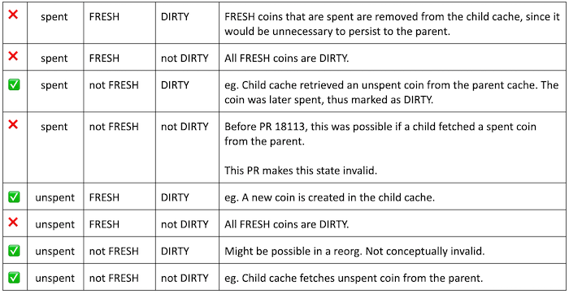

## Notes

- The coins database is the structure in Bitcoin Core which keeps track of the
  UTXO set. We looked at the coins database in a [previous PR Review Club
  (#17487)](./17487). The notes for that Review Club meeting include an
  excellent description of the caching for the coins database.

- The coins database is a key-value store. It was introduced in v0.8 ([PR
  1677 - Ultraprune](https://github.com/bitcoin/bitcoin/pull/1677)) where it was keyed by
  transaction. Pieter Wuille describes this change in a [recent Chaincode Podcast
  episode](https://podcast.chaincode.com/2020/01/27/pieter-wuille-1.html).

- In v0.15 the coins database was changed to be keyed by transaction _output_
  ([PR 10195](https://github.com/bitcoin/bitcoin/pull/10195)). For more
  information on that change see [this blog
  post](https://johnnewbery.com/post/whats-new-in-bitcoin-core-v0.15-pt1/).

- The 'prune' in ultraprune came from the fact that once all of the outputs
  from a transaction had been spent, that entry could be removed or 'pruned'
  from the coins database (note that this is a different concept from
  a pruned node, which deletes old block files that it no longer needs).  The
  'pruned' terminology for the coins database no longer makes sense - either a
  coin is unspent (and exists in the database) or is spent (and removed from the
  database).

- When the coins database was changed from per-transaction to per-txout,
  some of the 'pruned' code comments and variable names were left in. This PR
  was motivated by improving the clarity of those comments. Subsequently some
  additional small changes were added.

## Questions

1. Did you review the PR? [Concept ACK, approach ACK, tested ACK, or
   NACK?](https://github.com/bitcoin/bitcoin/blob/master/CONTRIBUTING.md#peer-review)
   (Don't forget to put your PR review on GitHub.)

2. This PR touches consensus-critical code. Does it meet the high bar
   for justifying a change to such critical code? Is improving
   code clarity justification enough?

3. What does it mean for a coin to be `FRESH`? What about `DIRTY`?

4. Coins in a coins cache can be:
     - spent or unspent,
     - `FRESH` or not `FRESH`, and
     - `DIRTY` or not `DIRTY`
   How many total states are there? How many of those are valid? Does this PR
   change that?

5. Could this change have a performance impact during block validation
   or Initial Block Download?

## Appendix

_(notes added after meeting)_

A summary of the validity of possible states, with explanation:

* For a description of FRESH & DIRTY, see comments
  [before](https://github.com/bitcoin/bitcoin/blob/5c9d408b2dd8c7a5b40b3e6051bb095eaad62604/src/coins.h#L117) &
  [after](https://github.com/bitcoin-core-review-club/bitcoin/blob/pr18113/src/coins.h#L117)
  this PR.
* For more details on possible cases, see
  [here](https://github.com/bitcoin-core-review-club/bitcoin/blob/pr18113/src/coins.cpp#L87).

## Meeting Log


13:00 < jnewbery> #startmeeting
13:00 < jkczyz> hi
13:00 < willcl_ark> hi
13:00 < fjahr> hi
13:00 < emzy> hi
13:00 < pinheadmz> hi
13:00 < michaelfolkson> hi
13:00 < amiti> hi
13:01 < nehan_> hi
13:01 < jnewbery> Hi folks. Welcome to PR Review Club! Feel free to say hi to let everyone know you're here.
13:01 < jnewbery> As always, feel free to jump in at any point to ask questions. No need to ask to ask, just ask!
13:01 < Prayank> Hello Everyone 😀
13:02 < jnewbery> wow. Emojis. That's novel :)
13:02 < jnewbery> This week's PR is rather short, but I think it's a good opportunity to dig into the coins structures a bit more. Notes are in the normal place: https://bitcoincore.reviews/18113.html
13:02 < andrewtoth> hi
13:02 < jonatack> hi
13:02 < lightlike> hi
13:02 < earpiece> hi
13:02 < jnewbery> who had a chance to review the changes? y/n
13:02 < fjahr> y
13:02 < pinheadmz> y
13:02 < andrewtoth> y
13:02 < amiti> y
13:02 < jkczyz> y
13:02 < emzy> y
13:03 < nehan_> n
13:03 < willcl_ark> y
13:03 < jnewbery> great. Solitary confinement seems to be doing wonders for people's time for code review
13:03 < jnewbery> question 1: Did you review the PR? Concept ACK, approach ACK, tested ACK, or NACK?
13:04 < jnewbery> and we might as well do question 2 at the same time: This PR touches consensus-critical code. Does it meet the high bar for justifying a change to such critical code? Is improving code clarity justification enough?
13:04 < fjahr> Concept ACK, the code looks good but I don't feel comfortable enough with everything especially considering reorgs
13:05 < fjahr> If it’s a significant improvement I think it is justified because it reduces the risk of bugs being introduced in the future and makes “real” improvements and new feature development easier
13:05 < willcl_ark> tACK from me. But I have to confess I was a bit less clear on the code-side this week. It was a new area for me to be looking at (i didn't attent the previous related meeting in Jan)
13:05 < emzy> Conxept ACK, seens the code is more clear for future changes.
13:05 < jnewbery> (it's my code but NACK is an acceptable answer)
13:05 < jkczyz> Concept ACK. IMHO, consensus-critical code *should* be clear
13:06 < andrewtoth> Concept ACK, but it seems like it's doing too much for how critical the code is. Could the renaming of PRUNED to SPENT and comment updates be a separate change to the consensus code change?
13:06 < jonatack> scripted diffs and improving commenting, even in consensus code, seem to still have a worthwhile benefit/risk ratio
13:06 < jnewbery> willcl_ark: the notes and meeting log from https://bitcoincore.reviews/17487 are really good, so I'd recommend reading through those if this has piqued your interest
13:07 < michaelfolkson> Yeah we can't leave consensus code untouched in fear of breaking something if clarity can be improved. Needs lots of review though
13:07 < jnewbery> andrewtoth: yes, this could definitely be split in two. One that changes the commends and variable naming, and then a second that makes the logical changes
13:08 < andrewtoth> It just seems like review will not be as focused with such a large diff and essentially two different things being changed
13:08 < jnewbery> that's fair feedback
13:08 < pinheadmz> jnewbery: the organization of the different cache layers is whats missing from my overall view of this PR
13:08 < nehan_> i think it would be better to split this PR into two: one for comments/no consensus changes and one with the changes
13:09 < jnewbery> pinheadmz: definitely check out https://bitcoincore.reviews/17487 and james's diagram here: https://jameso.be/dev++2018/#54
13:09 < willcl_ark> One thing I couldn't tell, is there any guarantee that this could not create a chain split? At a high level, if the change is modifying _both_ the code and the associated test, it seems like that guarantee is harder to prove...
13:10 < jnewbery> willcl_ark: if the logical change is bad, then yes, this could cause a consensus failure. Does anyone want to expand on how?
13:11 < jkczyz> regarding splitting into PRs, if the changes don't bleed across commits then I think one PR is fine. Unless the logical is contentious. But in that case the comments would need to be updated if the comment PR goes in first
13:11 < fjahr> consensus failure: a block would be rejected because different nodes have a different utxo set, one of them would miss a coin that is spent in the block
13:11 < Prayank> Interesting
13:12 < jnewbery> fjahr: yeah, that's what we should be scared about with any change like this
13:13 < jnewbery> I'm going to move onto the next question, but feel free to ask questions/give input on previous questions as we go
13:13 < jnewbery> What does it mean for a coin to be FRESH? What about DIRTY?
13:14 < amiti> DIRTY means it exists in the parent cache, but has been changed in the child cache
13:14 < amiti> FRESH means it doesn't exist in the parent cache
13:14 < jnewbery> amiti: exactly right
13:15 < fjahr> in the comment it says *potentially* different from the parent cache
13:15 < jnewbery> a Coin object can also be spent or unspent. How many different potential states are there?
13:15 < jkczyz> 8
13:15 < jnewbery> fjahr: ah yes, thanks for clarifying
13:15 < jnewbery> jkczyz: yes, and which of those are valid?
13:16 < jkczyz> good question. Haven't gone through all them yet :)
13:16 < amiti> if a coin is FRESH, is it *always* DIRTY, or is it *never* DIRTY?
13:16 < amiti> I think it has to be one of those two, right?
13:16 < michaelfolkson> fjahr: Why only potentially? It has been changed?
13:17 < lightlike> why can't a coin be "both FRESH and spent" then as one of the commit messages says? Couldn't it be created in the child cache, spent there and still be FRESH because it never existed in the parent?
13:17 < amiti> lightlike: my understanding is because in that case you could delete it from the child cache
13:18 < jonatack> jkczyz: i agree, istm the main reason to split would be if over time there was a lack of review that could be alleviated by splitting, or to get in worthwhile standalone changes if others were contentious.
13:18 < jnewbery> lightlike: important to distinguish between before this PR and after this PR
13:18 < fjahr> michaelfolkson: I am not 100% clear on this in which cases this occurs, I am referring to the comment in coins.h: "DIRTY: This cache entry is potentially different from the version in the parent cache"
13:18 < jnewbery> before this PR, a Coin could be spent and FRESH
13:19 < willcl_ark> Semantically that reads badly, but according to the two definitions above... it appears to be an acceptable state.
13:19 < lightlike> oh ok, got it.
13:20 < jnewbery> michaelfolkson: I'd need to look back at the code in validation.cpp, but I think there could be a situation where a coin gets deleted in a child cache and then re-created. It would then be the same as the parent cache but would be marked as DIRTY
13:20 < michaelfolkson> Ah ok
13:21 < michaelfolkson> Should it be marked as DIRTY in this case?
13:21 < jnewbery> I think that might happen in a re-org - the block that spent the coin is disconnected, which adds the coin to the cache, and then the competing block also spends the coin and it gets removed
13:22 < jnewbery> or something like that. The point is that if we change a coin in a cache, it MUST be marked as DIRTY
13:22 < michaelfolkson> Ok
13:22 < jnewbery> if not, changes might not get saved when the cache is flushed
13:23 < fjahr> michaelfolkson: To be sure you can not mark it as DIRTY you would probably have to check the parent cache all the time and that would be too much of a performance penalty I guess
13:23 < Prayank> I have a noob question. Sorry have not read much details but it looked interesting and this is my first meeting in core or review club. Does this FRESH and DIRTY thing in any way affect privacy when a full node interacts with other full nodes.
13:24 < fjahr> I don't really know, just speculating
13:24 < jnewbery> Prayank: noob questions are welcome here :)
13:24 < andrewtoth> FRESH must always be DIRTY. You cannot have a state with FRESH and not DIRTY.
13:24 < an4s> I am a noob here as well. Joined late so kind of outta sync
13:24 < amiti> andrewtoth: gotcha. thanks
13:25 < andrewtoth> because to be FRESH it must necessarily be different than what the parent has, since the parent does not have it
13:25 < jnewbery> andrewtoth: Yes, I think that's right. FRESH implies DIRTY
13:26 < michaelfolkson> Prayank: I would say not with these definitions of fresh and dirty. There is another context where coins from a coinbase transaction are referred to as fresh and that's where there's a potential privacy benefit
13:26 < fjahr> Let me try to answer Prayank: We are discussing internal management of data, this not information that is shared between nodes so it can't impact privacy
13:26 < Prayank> Thanks
13:26 < jnewbery> michaelfolkson: fjahr: exactly right
13:26 < amiti> so what's the point of additionally marking FRESH? Is there a performance benefit when flushing the cache?
13:27 < amiti> (before this PR)
13:27 < jnewbery> there's also another meaning of 'dirty' in the wallet for addresses that have already been used, but that is unrelated to what we're talking about here
13:28 < jnewbery> can anyone answer amiti? Why do we have FRESH at all?
13:28 < willcl_ark> So will nodes from before/after this patch be marking coins in their caches differently to each other, and therefore flushing them differently (risking chainsplit)? That's what I can't quite tell..
13:29 < andrewtoth> If it's marked FRESH and is spent, it can be removed instead of flushed to parent
13:29 < pinheadmz> jnewbery: i think its bc if that coin is spent, the parent caceh never needs to know about it
13:29 < andrewtoth> If it's not spent, it needs to be flushed to parent because it's also DIRTY
13:30 < jnewbery> willcl_ark: the logical change in this PR is to do with the node's internal caching strategy. The underlying coins database shouldn't be affected
13:30 < amiti> oh right. ah got confused and thought thats what this PR is introducing, but actually the change here is that we don't need to fetch spent coins
13:30 < amiti> right?
13:30 < jnewbery> (you could potentially remove the cache entirely and just use the disk's coins database and arrive at the same view of consensus, but performance would be horrendous)
13:30 < earpiece> fjahr: the pr is not related to P2P layer but so not information intentionally shared but the privacy impact to be answered is, are the changes creating a side channel etc
13:31 < willcl_ark> jnewbery: Ok thanks.
13:31 < jnewbery> (but only kinda - an extra layer of cache is used during block connection)
13:31 < jkczyz> Are the assumptions then (1) FRESH implies DIRTY and (2) spent coins should not have entries?
13:32 < earpiece> could a probing peering observe additional information by using the fresh/dirty/spent/unspent to exfiltrate info about wallet etc,  I don't think it could but not certain
13:32 < jnewbery> amiti: right. That' the change
13:32 < andrewtoth> Would spent and ~Dirty be an invalid state as well?
13:32 < jnewbery> earpiece: nice question. What do people think?
13:32 < fjahr> earpiece: good question. I don't think there is a chance because this is general chain state and it is not connected to the wallet
13:33 < jnewbery> fjahr: I agree. This is logic that all nodes do on all transactions/blocks, so leaks no information about the wallet
13:34 < jnewbery> earpiece: if you're interested in remote wallet side-channel attacks, check out the talk here: https://bitcoinops.org/en/newsletters/2020/02/26/#remote-side-channel-attacks-on-anonymous-transactions
13:34 < jnewbery> that paper deals with monero/zcash, but I think it's generally interesting
13:35 < earpiece> ah yeah, Tramer's work.  it's a good recent reference :)
13:35 < amiti> jkczyz: re (2) spent coins should not have entries -> if a coin is retrieved from the parent cache then spent in the child cache, it should have a DIRTY entry there until its flushed, right?
13:36 < jkczyz> amiti: Yeah, that was my thinking
13:36 < jkczyz> In which case I could only see three possible states
13:37 < jnewbery> amiti: jkczyz: yes, spent and DIRTY is a valid state. It means the child cache has spent the coin and that spentness needs to be propogated to the parent when the cache is flushed
13:37 < nehan_> jkczyz amiti: re(2) I think only coins that are created and spent in the child view should not have entries (with this change. instead of returning an entry with FRESH)
13:39 < andrewtoth> spent and not DIRTY is not a valid state though right?
13:39 < jnewbery> andrewtoth: it was before this PR. After this PR, it's not
13:40 < andrewtoth> ahh gotcha
13:40 < jnewbery> before this PR we could fetch a spent coin from the parent and keep it in the child cache. That would be spent and not-DIRTY
13:40 < nehan_> jnewbery: does that mean you can remove the line  return !coin.IsSpent() in GetCoin?
13:40 < nehan_> remove the check, that is.
13:41 < andrewtoth> I was looking at all the commenting changes and the actual logic change escaped me. Thanks!
13:41 < jkczyz> jnewbery: In that case I'll change my answer to 5 valid states :)
13:41 < amiti> jkczyz: before, or after the PR?
13:42 < jkczyz> after
13:42 < jnewbery> andrewtoth: that's another good reason to split this PR up!
13:42 < michaelfolkson> Not DIRTY is FRESH right? There are only two states. DIRTY and FRESH
13:43 < michaelfolkson> Oh no sorry, ignore me I'm with you
13:43 < nehan_> michaelfolson: no this tripped me up last time.  DIRTY is not the opposite of FRESH.
13:43 < jnewbery> what do people think of nehan_'s question? Can we remove the check for spentness in https://github.com/bitcoin/bitcoin/blob/3a8d25064e700ff2e69600cc1ede597751283a85/src/coins.cpp#L63 after this PR?
13:44 < nehan_> oh, no, because it might be spent in the child view
13:44 < jnewbery> right
13:45 < jnewbery> yes, FRESH and DIRTY aren't the most intuitive names. Perhaps NEWCOIN and MUSTFLUSH would be better
13:45 < amiti> I'm seeing 4 valid states with the PR. 1) spent, not fresh, dirty 2) unspent, fresh, dirty 3) unspent, not fresh, dirty 4) unspent, not fresh, not dirty.
13:45 < amiti> jkczyz: hows that match up to your 5?
13:46 < amiti> jnewbery: NEWCOIN and MUSTFLUSH would be _so_ much better
13:46 < nehan_> amiti: +1
13:46 < michaelfolkson> Start with 8 (2^3) and then subtract from that
13:46 < jonatack> +1 on better naming
13:47 < jnewbery> well they say there are only two hard things in computer science: naming things and cache invalidation, and we've covered both of them today
13:47 < andrewtoth> lol
13:47 < michaelfolkson> Do "they" say that?! haha
13:47 < jkczyz> amiti: also had (5) spent, fresh, dirty since FRESH implies DIRTY. Thinking if that one makes sense now...
13:48 < andrewtoth> It does make sense
13:48 < jnewbery> jkczyz: after this PR, a spent coin can't be FRESH
13:48 < amiti> jkczyz: thats the one that this PR changes. if it's fresh and spent, drop it.
13:48 < andrewtoth> It is a candidate to remove
13:48 < amiti> wait wait
13:49 < nehan_> i got four states as well
13:49 < amiti> ok nevermind, don't wait
13:49 < andrewtoth> it can't be spent and NOT dirty
13:49 < nehan_> yeah
13:49 < jnewbery> amiti: this PR doesn't change that. The behavior is already 'if it's spent and FRESH, drop it'. The change in this PR is 'don't fetch a spent coin from a parent cache'
13:50 < amiti> yeah thats what I mixed up before 🤦‍♀️
13:50 < jnewbery> which introduces a new invariant: a spent coin can now *never* be fresh
13:50 < amiti> maybe this time I'll get it :)
13:51 < jnewbery> ok 10 minutes left. I have one last question, but now is also your chance to say anything you've been holding back on
13:51 < jnewbery> Could this change have a performance impact during block validation or Initial Block Download?
13:51 < jkczyz> jnewbery: so 4 then?
13:51 < jnewbery> oh yeah, I agree that the answer is 4
13:51 < nehan_> ugh but which 4? i think i had the wrong ones too: 1) not dirty & not fresh & not spent (or does this mean it wouldn't be in the child cash?) 2) dirty & not fresh & spent 3) dirty & fresh & spent 4) dirty & not fresh & spent
13:51 < nehan_> s/cash/cache
13:52 < jnewbery> bitcoin cache?
13:52 < amiti> nehan_: #1 would be when a child retrieves a not spent coin from the parent, right?
13:52 < nehan_> because i think you're saying after this change #3 will no longer happen
13:53 < nehan_> amiti: right. just not sure when that happens?
13:53 < jnewbery> My 4 are: (spent & not-FRESH & not-DIRTY), (unspent & not-FRESH & not-DIRTY), (unspent & not-FRESH & DIRTY), (unspent & FRESH & DIRTY)
13:54 < jnewbery> nehan_: retrieving unspent coins from a parent happens all the time. It's how we retrieve coins from the disk coins DB
13:55 < amiti> jnewbery: why not (spent & not-FRESH & DIRTY)?
13:55 < jnewbery> any thoughts about performance impact?
13:56 < jonatack> This PR LGTM, but naming-wise I think "FRESH" and "DIRTY" generally imply mutually exclusive states to people.
13:56 < michaelfolkson> Agreed
13:56 < jnewbery> amiti: sorry you're right. Replace my first one with (spent and not-FRESH and DIRTY)
13:56 < nehan_> why wouldn't the first one happen?
13:57 < nehan_> that seems like the case where you read a spent UTXO from the parent
13:57 < jnewbery> nehan_: after this PR, we wouldn't keep it: https://github.com/bitcoin/bitcoin/pull/18113/commits/7053da36bf3879f1f160303f369605fd91ba957d#diff-cd7b305fd4b4280f22ae88960e60398eR48
13:57 < willcl_ark> jonatack: agree, FRESH is too close to (the opposite of DIRTY,) CLEAN
13:57 < nehan_> jnewbery: ah right, thanks
13:58 < willcl_ark> ...although CCoinsCacheEntry::Flags does explain pretty clearly what the two flags mean
13:58 < jnewbery> seems like we have almost unanimous agreement that the FRESH/DIRTY terminology is confusing!
13:58 < Prayank> Yes
13:59 < jnewbery> I think that naming should always be as intuitive as we can make it. Any confusion stemming from other associations with the name can eventually exhibit themselves as bugs
13:59 < jnewbery> ok, that's about time. I just realised that I didn't shill my own podcast episode in the notes, which is uncharacteristic of me
14:00 < jnewbery> if you like coins, you'll love https://podcast.chaincode.com/2020/02/26/utxos-5.html
14:00 < Prayank> lol
14:00 < jnewbery> #endmeeting
14:00 < jnewbery> thanks all!
14:00 < willcl_ark> so can we have an unspent && DIRTY coin?
14:00 < Prayank> Thanks 👍
14:00 < willcl_ark> thanks jnewbery
14:00 < michaelfolkson> I have a backlog to catch up on. The sipa one was immense
14:00 < michaelfolkson> Thanks
14:00 < amiti> thanks!
14:00 < nehan_> thanks
14:00 < emzy> Thanks jnewbery and all!
14:00 < jkczyz> thanks!
14:01 < pinheadmz> ty all confusing and interesting today
14:01 < jonatack> Thanks jnewbery and everyone! Good to see new people too :)
14:01 < jnewbery> willcl_ark: yes, a Coin can be uspent and DIRTY
14:01 < amiti> pinheadmz: well put 😂
14:01 < willcl_ark> jnewbery: is that the re-org case?
14:01 < fjahr> jnewbery: Since the spent coins from the parent cache are skipped there could be a small performance impact?
14:01 < andrewtoth> Thanks jnewbery!
14:01 < fjahr> Thanks!
14:02 < jnewbery> fjahr: too late!
14:02 < fjahr> jnewbery: i mean small performance improvement
14:02 < fjahr> :(
14:02 < jnewbery> I don't know the answer for sure. I was just throwing it out there as a conversation starter
14:03 < fjahr> ok
14:03 < jonatack> fjahr: I'm thinking it's possible but only benchmarking can tell. Have to measure.
14:03 < jnewbery> jonatack: agree with benchmarking

