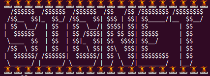

<p></p>

The [Bitcoin wiki](https://en.bitcoin.it/wiki/Signet) defines signet as
"a proposed new test network for the Bitcoin block chain which adds an
additional signature requirement to block validation."

This pull request implements the portion of
[BIP325](https://github.com/bitcoin/bips/blob/master/bip-0325.mediawiki)
responsible for connecting to a signet network and validating blocks (it does
not implement the code required by miners to sign signet blocks). We are
touching consensus-critical code today! Let's make sure we do it right :-)

Because this PR is rather large, we are going to focus on the first four
commits:

- [validation: move GetWitnessCommitmentIndex to consensus/validation](https://github.com/bitcoin-core-review-club/bitcoin/commit/9620f95e)

- [add signet basic support (signet.cpp)](https://github.com/bitcoin-core-review-club/bitcoin/commit/7f9f3d30)

- [add signet chain and accompanying parameters](https://github.com/bitcoin-core-review-club/bitcoin/commit/699668ca)

- [consensus: add signet validation](https://github.com/bitcoin-core-review-club/bitcoin/commit/22d28831)

Once the PR branch is built, you can connect to signet by creating a new data
directory and launching the development build of Bitcoin Core:

```
# make a new data directory
$ mkdir /absolute/path/to/datadir/for/signet

# enter the bitcoin repo where this PR is built locally
$ cd bitcoin

# launch!
$ src/bitcoind -signet -datadir=/absolute/path/to/datadir/for/signet

# generate a signet address
$ src/bitcoin-cli -signet -datadir=/absolute/path/to/datadir/for/signet getnewaddress
```

## Notes

- The PR author, [kallewoof](https://github.com/kallewoof), maintains a signet
  [faucet](https://signet.bc-2.jp/). If you can run the branch and generate a
  signet address, you can request a payout!

- At the start of this meeting, I'll ask everyone for their signet address and
  reward participants who answer questions correctly or ask their own good
  questions!

## Questions

1. Why do we need test networks and what problems (if any) do we have with the
   current testnet?

2. What are some of the
   [parameters](https://github.com/bitcoin-core-review-club/bitcoin/blob/pr18267/src/chainparams.cpp)
   that distinguish mainnet, testnet and signet?  Which of these do the
   different networks have in common? What makes signet special?

3. How many signets are there? Could we start our own just for review club, and
   if so, how?

4. What parts of this PR affect consensus-critical code for nodes running on
   mainnet?

5. What new
   [configuration options](https://github.com/bitcoin-core-review-club/bitcoin/blob/pr18267/src/chainparamsbase.cpp)
   have been added?

6. What are `CMutableTransaction tx_to_spend` and `CMutableTransaction
   tx_spending`? (Defined in
   [`src/signet.cpp`](https://github.com/bitcoin-core-review-club/bitcoin/blob/pr18267/src/signet.cpp#L68-L80))
   Who broadcasts these transactions?

7. Why was `GetWitnessCommitmentIndex()` moved? Was anything altered?

8. (bonus) Did you build the GUI? How does it look
   [different](https://github.com/bitcoin-core-review-club/bitcoin/blob/pr18267/src/qt/networkstyle.cpp#L22)
   from mainnet?

9. (double bonus) [Why is the signet commitment concatenated to the witness
   commitment and not in its own
   `OP_RETURN`?](https://github.com/bitcoin/bips/pull/947/files#r463053062)

## Meeting Log


17:00 < pinheadmz> #startmeeting
17:00 < michaelfolkson> Can continue after. Meeting starting in seconds
17:00 < pinheadmz> Welcome to Bitcoin Core PR Review Club! Today's PR is #18267 implementation of BIP-325
17:00 < pinheadmz> also known as...
17:00 < felixweis> hi
17:00 < pinheadmz> 🌋 🌋 🌋 🌋 🌋 🌋 🌋 🌋 🌋 🌋 🌋 🌋 🌋 🌋 🌋 🌋 🌋 🌋 🌋 🌋
17:00 < pinheadmz>   /$$$$$$  /$$$$$$  /$$$$$$  /$$   /$$ /$$$$$$$$ /$$$$$$$$
17:00 < pinheadmz>  /$$__  $$|_  $$_/ /$$__  $$| $$$ | $$| $$_____/|__  $$__/
17:00 < pinheadmz> | $$  \__/  | $$  | $$  \__/| $$$$| $$| $$         | $$
17:00 < pinheadmz> |  $$$$$$   | $$  | $$ /$$$$| $$ $$ $$| $$$$$      | $$
17:00 < pinheadmz>  \____  $$  | $$  | $$|_  $$| $$  $$$$| $$__/      | $$
17:00 < pinheadmz>  /$$  \ $$  | $$  | $$  \ $$| $$\  $$$| $$         | $$
17:00 < pinheadmz> |  $$$$$$/ /$$$$$$|  $$$$$$/| $$ \  $$| $$$$$$$$   | $$
17:00 < pinheadmz>  \______/ |______/ \______/ |__/  \__/|________/   |__/
17:00 < pinheadmz> 🌋 🌋 🌋 🌋 🌋 🌋 🌋 🌋 🌋 🌋 🌋 🌋 🌋 🌋 🌋 🌋 🌋 🌋 🌋 🌋
17:00 < Alistair_Mann> a25
17:00 < jonatack> ohai
17:00 < nehan> hi
17:00 < emzy> hi
17:00 < fjahr> hi
17:00 < theStack> hi
17:00 <@jnewbery> 🤯
17:00 < michaelfolkson> Ok.... that is cool
17:00 < amiti> hi
17:00 < Dylan21m> hi
17:00 < michaelfolkson> hi
17:01 < sunon> Hey everyone
17:01 < robot-dreams> hi
17:01 <@jnewbery> steady on pinheadmz. People will expect fireworks every time now
17:01 < b10c> hi
17:01 < nehan> my expectations for future pr review clubs have gone up
17:01 < sipa> ¡ʇǝuƃıs
17:01 < willcl_ark> hi
17:01 < jkczyz> hi
17:01 < pinheadmz> jnewbery raising the bar :-) party time!
17:01 < pinheadmz> welcome everyone! Please be polite and respectful to each other. Everyone is here to learn and express curiosity.
17:01 < jonatack> that literally leaps out of the screen... congrats pinheadmz
17:01 < gzhao408> hi!
17:01 < pinheadmz> Most of the questions have multiple answers and some of them have kinda tricky answers -- so don't be afraid to take guesses or use your imagination!
17:02 < LarryRuane> hello everyone
17:02 < pinheadmz> Let's start with a quick sign-in: Two y/n questions:
17:02 < pinheadmz> Did you review the PR?  /  Did you build the branch and connect to signet?
17:02 < pinheadmz> y /y
17:02 < nehan> y / y
17:02 < jkczyz> n / n
17:02 < jonatack> y / y
17:02 < theStack> n / n
17:02 < sunon> n / n
17:02 < b10c> n / y
17:02 < amiti> y / y
17:02 < michaelfolkson> y/y
17:02 < Alistair_Mann> y/ny
17:02 < robot-dreams> y/y
17:02 < LarryRuane> y (sort of) / y
17:02 < Dylan21m> y/n
17:03 < sipa> ±/n
17:03 < fjahr> y/y but only older version
17:03 <@jnewbery> 0.1y/n
17:03 < pinheadmz> Those of you that were able to connect and generate a receive address, feel free to drop it here - you might win some worthless signet coins by participating!
17:03 < emzy> y
17:04 < emzy> y/y
17:04 < LarryRuane> tb1qtjtf4hcjq3c9dnx0gy57lpd43427ttq5a8jfzu
17:04 < jonatack> tb1qzdu76vyh6cpz9ehdz27u4sf8erzgz76m2kg2rw
17:04 < robot-dreams> tb1qgcq63q0qrwe2x2arpdds7rr5ek4qasu9vm80at
17:04 < emzy> tb1qplt4vxhanqtepew5te605t2f9k9kkdpvysa89z
17:04 < jonatack> send me 1 get 2 back
17:05 < pinheadmz> OK let's dig in: Can anyone start us off with a quick definition of signet?
17:05 < michaelfolkson> tb1qcdntxa942mg620gnlh6kqs8th3yayqgr7xnmgt
17:05 < nehan> tb1qhx8vzcl0hv6mjas06z28t5xt2834h38lz2jj4z
17:05 < sipa> building
17:05 < amiti> tb1qwhxgd9l9znletzjrd500s8jjgqzuy2mxaevhru
17:05 < michaelfolkson> Anyone new here?
17:06 < sunon> I’m new
17:06 < emzy> jonatack: I'm waiting ;)
17:06 < nehan> sunon: welcome!
17:06 < Dylan21m> i'm new too.
17:06 < subzero> sunon welcome to PR review club
17:06 < sunon> Thank you!
17:06 < Dylan21m> just watching this time :)
17:06 < subzero> welcome Dylan21m !
17:06 < pinheadmz> welcome new folks!
17:06 < Dylan21m> thank you
17:06 < emzy> Welcome!
17:07 < pinheadmz> ok Im upping the bounty: 0.1 sBTC for a definition of signet ?!
17:07 < jonatack> a stable, centralized testnet
17:07 < robot-dreams> signet is a new test network that lets you specify custom block validation requirements; basically a way to have a realistic but sandbox'd test network
17:07 < theStack> i'd say signet is a new type of test network, one with an additional requirement for blocks to be accepted (a signature), which allows more control
17:07 < jonatack> from optech: Signet is both a tool that allows developers to create networks for testing interactions between different Bitcoin software and the name of the most popular of these testing networks.
17:07 < nehan> jonatack: we could have held out for more
17:07 < felixweis> n4FggkKF1c7mEbKqqHU6vz6C4gRFSHb51p
17:07 < jonatack> nehan: hehe
17:07 < pinheadmz> robot-dreams wins a coin!
17:08 < pinheadmz> felixweis is that a signet address? perhaps its non-witness? kinda interesting
17:08 < sipa> important to stress that signet is both a mechanism to build custom networks with a centralized component, and the name of a specific global testnet
17:08 < subzero> pinheadmz signet is construction of the bitcoin network with signatories signing blocks instead of mining which allows rapid testing for network generation for evaluating network performance
17:08 < pinheadmz> subzero good answer but also mining still happens - proof of work is still required, but ALSO the sig- rules
17:08 <@jnewbery> subzero: not instead of!
17:08 <@jnewbery> as well as
17:09 < felixweis> pinheadmz: correct, a legacy address on signet
17:09 < subzero> pinheadmz jnewbery PoW for anti DoS or other reasons?
17:09 < pinheadmz> felixweis sending you 0.001 just bc ur unique :-)
17:09 < theStack> alternative definition: "permissioned blockchain" :p
17:09 < felixweis> <3
17:09 < nehan> i don't recall seeing anything about "custom block validation requirements" in the first 4 commits -- is that later?
17:09 < notmandatory> is it possible or anticipated that there will be project specific signet instances? or the a shared signet , like testnet the idea?
17:09 <@jnewbery> subzero: that's a good question. Maybe pinheadmz will put up a bounty to answer it
17:09 < michaelfolkson> It is down to the signers. If they don't want anyone else to mine they can stop other people mining
17:10 < michaelfolkson> But on the default Signet the plan is to let other people mine
17:10 < pinheadmz> michaelfolkson is that right?
17:11 < jonatack> emzy: done; bitcoin-cli -signet -datadir=signet sendtoaddress tb1qplt4vxhanqtepew5te605t2f9k9kkdpvysa89z 2 "emzy" "2-for-1" false true 1000 sat/B
17:11 < pinheadmz> i think in the curent state of the PR only a selected set of users can mine
17:11 < robot-dreams> nehan: great point, I'm using terminology loosely but basically referring to `CheckSignetBlockSolution`
17:11 < nehan> robot-dream: ah ok i thought i missed some sort of plug-and-play validation config :)
17:11 < sipa> what is the current signet height?
17:12 < michaelfolkson> pinheadmz: Current state maybe... But there really is no point to having proof of work if only the signers are mining
17:12 < robot-dreams> sipa: I got 2511
17:12 < pinheadmz> sipa 2511
17:12 < sipa> me too!
17:12 < b10c> https://explorer.bc-2.jp/ too
17:12 < pinheadmz> ok lets get into the questions: Why do we need test networks and what problems (if any) do we have with the current testnet?
17:12 < sipa> tb1qq5rjrnvp2j0p7m327yrp7ny7dt26qt6y88ed2e
17:13 < emzy> jonatack: It realy worked!  "txid": "deff5000b95dfb22e07e3dde631dabf831f53e0d25e186476625bdc7fe791dfb"
17:13 < nehan> uh am i on a different signet? I'm at 4015
17:13 < jonatack> emzy: while stocks last, offer limited to one per person
17:13 < theStack> pinheadmz: it's permissionless, which is may not always optimal for testing scenarios
17:13 < pinheadmz> michaelfolkson i think youre question is kinda tied into question 1 here -- what are some of the issues with testnet3? (our current testnet)
17:14 <@jnewbery> subzero: I believe it's so that any client that works on mainnet can switch to working with signet with minimal changes
17:14 < emzy> jonatack: I should have send 5 sBTC... ;)
17:14 < felixweis> takes forever to sync, get started. diff=1 after 20 min is making it a pain to work with
17:14 < pinheadmz> theStack correct! what kinds of things happen on testnet if "we just let anybody mine" ?
17:14 < LarryRuane> test networks let us do things that would risk losing real value on mainnet (and we might not have value on mainnet)
17:14 < robot-dreams> pinheadmz: if "we just let anybody mine", could a troll with lots of mining hardware get the difficult really high and then leave?
17:14 < nehan> hmm. did signet get restarted in the last few days?
17:14 < pinheadmz> LarryRuane correct! like lightning network #reckless
17:14 < sipa> nehan: i believe so
17:14 < pinheadmz> robot-dreams correct!
17:15 < theStack> robot-dreams: +1
17:15 < felixweis> random many 100s of blocks reorgs happen on a regular basis, making every assumptions lightnig e.g. takes for 6 confs = open channel.
17:15 < jonatack> nehan: yes, reset, new POW
17:15 < sipa> jnewbery: also DoS protection; PoW correctness is checked before downloading headers; signet signature only when downloading the full block
17:15 < jonatack> have to reindex or rm -rf
17:15 < pinheadmz> ill add an answer as well: i was debugging SPV mode on testnet and got stuck on a fork of nodes that are stuck on inflation blocks from last year. theyre still out there. and spv wallets cant tell theyre broken
17:15 < subzero> isn't another downside to testnet is there a bug in testnet difficulty that roasbeef talked about?
17:15 < sipa> eh, before downloading *blocks*
17:15 < nehan> sipa: jonatack: ok!
17:15 <@jnewbery> nehan: yes, there was an underflow bug with the minimum difficulty so they had to reset
17:16 < nehan> out-of-band communication necessary to agree on best blockchain
17:16 < pinheadmz> sipa robot-dreams and jonatack getting coins from a sendmany!
17:16 < jonatack> istm testnet suffers from large variance in block emission
17:16 < theStack> considering that mentioned drawback of testnet, it's kind of surprising to me that there have only been three generations of testnet yet (and not more)
17:16 < sipa> received 88f4ee78856ee88d6eeef3514821ddc6bfa89ca0b6c6146b6b21c8827eb83dd3 !
17:17 < notmandatory> pinheadmz: is another prob with testnet is since it's random miners it's harder to coordinate reproducing specific mining scenarios to test against?
17:17 < fjahr> re: PoW I assumed it would have been more code changes and more difficult to review the code if PoW was completely removed
17:17 < pinheadmz> notmandatory thats interesting and a good point
17:17 < sipa> fjahr: not to mention it being less representative of the real network
17:17 < b10c> will testnet3 be deprecated once signet is adopted?
17:17 < petemyers> Hi I'm new, I'm sorry I didn't say earlier.
17:17 < pinheadmz> if you WANT to test reorgs, its hard to coordinate one on a public network
17:17 < pinheadmz> hi petemyers !
17:17 < jonatack> welcome petemyers
17:18 < subzero> welcome petemyers
17:18 < petemyers> Thanks. Just lurking this time.
17:18 < michaelfolkson> No b10c, it will continue. No way to stop it even if we wanted to
17:18 < pinheadmz> Ok I'm going to push forward so we can get to more good stuff
17:18 < pinheadmz> What are some of the parameters that distinguish mainnet, testnet and signet? Which of these do the different networks have in common? What makes signet special?
17:18 < pinheadmz> lots of answers to this question
17:18 < michaelfolkson> But it could possibly get reset
17:18 < b10c> michaelfolkson: thanks
17:19 < emzy> I'm waiting for a block. Can someone please sign a new one? ;)
17:19 < robot-dreams> pinheadmz: one small difference is default ports are different: 8333 (mainnet), 18333 (testnet), 38333 (signet)
17:19 < pinheadmz> robot-dreams yes!!
17:20 < pinheadmz> robot-dreams is getting sig-rich over here!
17:20 < pinheadmz> anyone else?
17:20 < notmandatory> pinheadmz also of course different genesis blocks
17:20 < michaelfolkson> Only Kalle and AJ are block signers currently emzy
17:20 < pinheadmz> notmandatory yes!
17:20 < theStack> pinheadmz: unlike mainnet and testnet, on signet even the most powerful miner could never submit a block if he can't provide the right signature
17:20 < Alistair_Mann> bitcoin.conf contains signet=1 / or -signet on cli
17:20 < pinheadmz> theStack great point!!
17:21 < LarryRuane> if a group of people want to set up their own "private" signet, they'd have to choose different port numbers?
17:21 < michaelfolkson> Network magic too
17:21 < pinheadmz> LarryRuane good question, 0.001 sBTC for you -- does any one know?
17:21 < emzy> michaelfolkson: so who I call first?
17:21 < pinheadmz> michaelfolkson  yes!
17:21 < michaelfolkson> Whoever you want to wake up emzy ;)
17:21 < robot-dreams> 🤯 I am at 0.1111 (if I'm lucky maybe I'll get to 0.11111111 by the end of this session)
17:21 < robot-dreams> 0.111*
17:22 < LarryRuane> changing port numbers and network magic is a source code change, or can be specified on the command line?
17:22 < pinheadmz> LarryRuane so i think you are right the ports defined in chainparams but that can be customized
17:22 < michaelfolkson> I think it is Kalle's script currently mining. So it would be him rather than AJ
17:22 < pinheadmz> LarryRuane however, the magic bytes would prevent yu from actually connecting to the wrong signet
17:23 <@jnewbery> powLimit is different between mainnet, regtest and signet
17:23 < emzy> Could be interesting to have another network magic on the same port...
17:23 < pinheadmz> jnewbery nice answer, a deep cut
17:23 < pinheadmz> i will donate your signet btc to charity
17:24 < jonatack> signet is the only chain where consensus.signet_blocks = true
17:24 < sipa> changing ports isn't strictly necessary, but it helps if people want to run both networks on one IP
17:24 <@jnewbery> thank you. benevolent bitcoiners fund please
17:24 < pinheadmz> jonatack great answer! yes i was about to go there
17:24 < pinheadmz> so signet is special, not just because it has different magic bytes or p2p ports but it is the only network where checking signet blocks is a thing!
17:25 < robot-dreams> LarryRuane: yeah, good question: you can specify the port as a command line argument `-port=<port>`, or in the config file; however, I don't think you set network magic this way
17:25 < pinheadmz> and we kinda touched on this next question already: How many signets are there? Could we start our own just for review club, and if so, how?
17:26 < theStack> pinheadmz: the sky is the limit :)
17:26 < pinheadmz> theStack correct! and if we wanted to create a unique signet right now, which `conesensus.______` property would we set ?
17:27 < michaelfolkson> robot-dreams LarryRuane: The network magic is set for the default Signet in the source code. If you set up a new Signet you would adjust it
17:27 < robot-dreams> pinheadmz: `signet_challenge`?
17:27 < jonatack> also the address format: the bech32 human readable parts vary between the chains: bc, tb, bcrt
17:27 < pinheadmz> michaelfolkson ooooh not just that.... but perhaps the magic bytes get set automatically soemhow ??!?!?!?!??!?!?!
17:27 < pinheadmz> robot-dreams correct!
17:27 < theStack> though i guess the practical limit would probably be the possible number of network magic combinations, i.e. ~2^32?
17:27 < pinheadmz> jonatack correct although we realized signet has the same human-readbale-part as testnet
17:28 < pinheadmz> theStack thats an interesting point
17:28 < pinheadmz> but even if we overflow the magic bytes, you can still have unlimited signet_challenge 's
17:28 < emzy> I think the max signets are 2^256
17:28 < emzy> * number of
17:29 < pinheadmz> emzy can you explain how you came up with that ?
17:29 < jonatack> note that -signet_challenge was just renamed from -signet_blockscript
17:30 < sipa> i'd say there is an infinity of possible signets... but once you get close to 2^128you run into problems with potential collisions across block hashes (if you care about those)
17:30 < emzy> pinheadmz: I just tought the magic has someting with the genisis hash in common. But not sure.
17:30 < pinheadmz> i jsut sent a sBTC sendmany to everyone!!! such great asnwers
17:30 < sunon> Less than infinity
17:31 < pinheadmz> emzy well this an interesting point. the magic bytes sort of help us identify peers on the correct network, but the actual "consensus rules" for block validation are set by signet_challenge
17:31 < pinheadmz> which, as sipa points out, could literally be anything
17:31 < LarryRuane> the help for -signet_challenge says "Blocks must satisfy the given script to be considered valid" ... what does satisfy mean in this case?
17:31 < emzy> pinheadmz: right
17:31 < pinheadmz> and while we're on that note - does anyone know what exactly signet_challenge is? what type of data that is?
17:31 < notmandatory> pinheadmz does the magic also prevent you from discovering and connecting to the wrong network peer nodes?
17:31 < pinheadmz> LarryRuane is on the right track
17:32 < robot-dreams> pinheadmz: not confident, but is it an arbitrary scriptPubKey?
17:32 < pinheadmz> notmandatory if you recieve a p2p message with the wrong magic bytes ,you just disconnect
17:32 < pinheadmz> robot-dreams correct! it is an output script
17:32 < pinheadmz> its sort of arbitrary, but it is the one thing that defines a signet network
17:32 < michaelfolkson> Any problems with setting up a Signet using the same network magic as an existing Signet network? I'm guessing you'll just get transactions and blocks sent to you you are not interested in?
17:32 < jonatack> yes...ParseHex(signet_challenge[0]), must be a single value
17:33 < pinheadmz> michaelfolkson correct it would be like connecting BTC nodes to BCH nodes :-/ (which IIRC have the same port and magic bytes? still? idk)
17:33 < sipa> michaelfolkson: it just means you won't immediately detect you're connected to the wrong network
17:33 < pinheadmz> right, you dont disconnect right away but youll figure it out soon enough when all the incoming blocks and txs are invalid
17:33 < sipa> right, exactly
17:33 < pinheadmz> so heres a quick bonus Q. the (default) signet_challenege in the PR is:
17:33 < pinheadmz> 512103ad5e0edad18cb1f0fc0d28a3d4f1f3e445640337489abb10404f2d1e086be430210359ef5021964fe22d6f8e05b2463c9540ce96883fe3b278760f048f5189f2e6c452ae
17:33 < pinheadmz> does anyone know what this means?
17:34 < pinheadmz> can transalte into english or at least bitcoin-speak?
17:34 < sipa> 51 is OP_1
17:34 < pinheadmz> hint: there is a single rpc command that can *ahem* DECODE this RAW SCRIPT
17:34 < sipa> 21 means push the next 33 bytes
17:34 < sipa> what follows looks like a pubkey
17:35 < pinheadmz> sipa is doing it in his head, of course
17:35 < jonatack>  bitcoin-cli -signet -datadir=signet decodescript
17:35 < pinheadmz> jonatack yes! so what is this default signet challenge all about ?
17:36 < emzy> decodescript works
17:36 < LarryRuane> pinheadmz "but youll figure it out soon enough" ... then what, ban those peers?
17:36 < jonatack> multisig 2 addresses
17:36 < pinheadmz> jonatack yep! 0.2 for you
17:36 < b10c> ae at the end is OP_CHECKMULTISIG
17:36 < pinheadmz> and what are the m of n values ?
17:36 < pinheadmz> b10c correct!
17:36 < sipa> LarryRuane: it's complicated
17:36 < jrawsthorne> Very late. This is my first time. Anyone want to be generous and send some coins tb1qsk6mtay6kzm9t0gx8lvu07g89d0ty6w4v4qzxm
17:36 < jrawsthorne> 1 of 2
17:37 < pinheadmz> jrawsthorne correct!
17:37 < pinheadmz> sending you worthless coins !
17:37 < pinheadmz> its a 1 of 2 multisig
17:37 < pinheadmz> that means there are two private keys that can mine blocks
17:37 < sipa> LarryRuane: we no longer ban misbehaving peers since recently; they just get discouraged (which means temporarily avoided for new connections, and prioritized for disconnection if we reach our connection limit)
17:37 < pinheadmz> probably that means two people
17:38 < pinheadmz> only one of those keys needs to sign for a signet block to be valid
17:38 < sunon> Two for that specific network?
17:38 < jonatack> sipa: fwiw signet is "Disconnecting and discouraging peer 49!" ~ every couple minutes
17:38 < b10c> one key belongs to kalle and one to AJ?
17:38 < michaelfolkson> For the default Signet
17:38 < sunon> Ah
17:38 < michaelfolkson> Yes b10c
17:39 < pinheadmz> ok we are about to level up everyone -- any lingering questions before we move on to implementation details?
17:39 < sipa> jonatack: what is the reason? old signet nodes?
17:39 < pinheadmz> (man we really need a new block, im almost at my unconfrimed limit!)
17:39 < pinheadmz> ok here we go:
17:39 < jonatack> afaict it's only people running tor?
17:39 < pinheadmz> What are CMutableTransaction tx_to_spend and CMutableTransaction tx_spending? (Defined in src/signet.cpp) Who broadcasts these transactions?
17:39 < emzy> pinheadmz: you know who to call. ;)
17:40 < jonatack> curious if anyone else is seeing it
17:40 < pinheadmz> these structures are kinda new in this PR's life and actually BIP-325 was recently updated to include them
17:40 < jonatack> afaict usually signet by default connects only to one peer, unless you -addnode
17:40 < robot-dreams> pinheadmz: I think they are generated from a block, as a convenient way to reuse signature validation to check if the _block_ is valid for that signet
17:41 < sipa> robot-dreams: not just the verification, but signing also
17:41 < nehan> trick question: no one broadcasts them
17:41 < pinheadmz> nehan WINNER YES YE SY ES EY SYEYS EY
17:41 < pinheadmz> im so excited i cant type
17:41 < pinheadmz> isnt that just so interesting?
17:41 < sipa> it means all infrastructure that exista for agreeing on and signing transactions can be reused for signet signing
17:41 < nehan> yeah it's cute to leverage transaction verification for signet verification
17:41 < pinheadmz> we have these transactions that dont get broadcast at all
17:42 < pinheadmz> nehan getting 0.1 sBTC for answering my fav question in the meeting today
17:42 < sipa> they're imaginary transactions :)
17:42 < robot-dreams> sipa: is this signing done once per block?
17:42 < sipa> yes
17:43 < pinheadmz> so why are there two?
17:43 < pinheadmz> can anyone explain what is happening under the hood here?
17:43 < pinheadmz> we have these two hard-coded tx templates
17:43 < emzy> nice usage of transaction verification.
17:43 < nehan> one to specify the scriptPubKey and another to provide the scriptSig
17:43 < pinheadmz> and this signet_challenge
17:43 < felixweis> how do i get a taproot send/spend in a block, isn't it still non-standard so it won't be forwarded by nodes?
17:43 < pinheadmz> nehan correct!
17:43 < sipa> has signet forked in taproot already?
17:44 < pinheadmz> sipa  no
17:44 < michaelfolkson> You can only get a Taproot output in a block felixweis, not spend it
17:44 < pinheadmz> felixweis you can actually send coins to a witness V1 program right now
17:44 < pinheadmz> and that output is anyone can spend
17:44 < sipa> spending would be nonstandard
17:44 < pinheadmz> yeah and we talked a bit about this last week i think in a taproot review club meeting
17:45 < felixweis> is there a pushtx php script or so to get it to a miner?
17:45 < nehan> pinheadmz: i had to blow away my previous signet installation and i deleted my previous wallet :(
17:45 < pinheadmz> nehan me too :-( good thing coins are free
17:45 < jonatack> nehan: yup same
17:45 < pinheadmz> OK so we got these 2 Txs, and we know that the scriptPubKey in the output of the first tx is set by whoever launches the signet or sets it with command line argument
17:45 < nehan> was curious if there was some smart way to do this without deleting the wallet?
17:45 < pinheadmz> so the scriptSig and witness though...
17:46 < jonatack> nehan: reindex i thinx
17:46 < nehan> jonatack: did not work
17:46 < pinheadmz> nehan i found all my previous txs were actually abandoned. i think bc the chain reset. no reindex can save you in that state
17:46 < michaelfolkson> Yup same
17:46 < jonatack> nehan: oh :(
17:46 < nehan> pinheadmz: ah yeah the coinbases are new, ok
17:46 < jonatack> i didn't try, went straight for the rm -rf
17:47 < petemyers> I gotta go, thanks for letting me watch your discourse about sBTC txs! Toe in the water. A helpful prompt for what I need to read next. See you all next week.
17:47  * michaelfolkson waves
17:47 < pinheadmz> Ok 0.1 sBTC for the first answer: The tx_spending scriptSig and witness
17:47 < pinheadmz> where does it come from?
17:47 < robot-dreams> pinheadmz: from BIP325, "A block is considered fully validated only if the to_sign transaction is a valid spend of the to_spend transaction"
17:48 < pinheadmz> robot-dreams yes! so if I am a miner, how do I do that?
17:48 < pinheadmz> or, more in the scope of this PR - if I am A *validator* where do i look for that data ?
17:48 < nehan> it's somewehre in the coinbase
17:48 < robot-dreams> the witness commitment
17:48 < pinheadmz> coins for robot-dreams and nehan !
17:49 < pinheadmz> yeah its not really "in" the witness commitment right?
17:49 < pinheadmz> but, concatenated to it
17:49 < robot-dreams> right
17:49 < jonatack> CheckSignetBlockSolution()
17:49 < pinheadmz> and if kallewoof or aj were here maybe id get an answer to the double-bonus question
17:49 < sipa> isn't it a separate commitment?
17:49 < pinheadmz> maybe sipa has insight
17:49 < nehan> i was confused by the bip spec. why is bytes 1-5?
17:49 < pinheadmz> ha!
17:49 < pinheadmz> sipa https://github.com/bitcoin/bips/pull/947/files#r463053062
17:49 < nehan> Does that mean the first 5 bytes, or a variable length thing?
17:50 < robot-dreams> pinheadmz: follow-up question for double bonus, would it be harder to find the correct index (instead of just calling the existing `GetWitnessCommitmentIndex`) if we had a separate `OP_RETURN`?
17:50 < sipa> pinheadmz: ah indeed
17:50 < pinheadmz> robot-dreams thats a good insight
17:50 < sipa> not sure that's a good idea
17:50 < pinheadmz> it could just be to reduce that complexity
17:51 < pinheadmz> thered have to be a new function `getSignetCommitmentIndex` i suppose
17:51 < pinheadmz> and also another goal of signet we didnt mention yet is that we want it to otherwise be as close to mainnet as possible
17:51 < pinheadmz> so idk, miners add extra opreturns for different reasons all the time
17:51 < pinheadmz> but maybe the design motivation here is just change as little as possible
17:51 < sipa> perhaps
17:52 < sipa> it means that "real" consensus extensions (like a second witness...) can'
17:52 < sipa> use that same position
17:52 < pinheadmz> oh interesting
17:52 < pinheadmz> second witness ?
17:52 < pinheadmz> like an extension block comitment or something?
17:52 < sipa> for example
17:52 < sipa> highly hypothetical of course
17:53 < pinheadmz> good point, this signet spec limits other uses for that one opreturn
17:53 < pinheadmz> or compact filter comitment
17:53 < pinheadmz> but i think these could just as easily end up in theri own output anyway right?
17:53 < robot-dreams> sipa: is it more likely that other consensus extensions would use a new OP_RETURN or use bytes 39 onwards of the witness commitment?
17:53 < sipa> well signet in such a hypothetical scenario could adapt to either say "the second witness commitment goes after the signet one", or could move itself to the end
17:53 < jonatack> Kalle, 3 days ago: "I would like to avoid deviating from mainnet parameters as much as possible, permanently." https://github.com/bitcoin/bitcoin/pull/18267#discussion_r484069009
17:53 < sipa> robot-dreams: who knows
17:53 < robot-dreams> fair enough :)
17:53 < sipa> not a big deal
17:54 < pinheadmz> Ok last 5 minutes!
17:54 < pinheadmz> Why was GetWitnessCommitmentIndex() moved? Was anything altered?
17:54 < subzero> is everyone else's signet chain tip: best=000000dcb98799f73c53bc720520064656e40af9e92611cc7e4af6b273eaa2f0 height=2514 ?
17:54 < pinheadmz> subzero yeah me too
17:54 < robot-dreams> subzero: yes
17:55 < nehan> subzero: yes
17:55 < sipa> 000000dcb98799f73c53bc720520064656e40af9e92611cc7e4af6b273eaa2f0
17:55 < sipa> (use getchaintips)
17:55 < pinheadmz> last question is more about the code than the concept
17:55 < pinheadmz> https://github.com/bitcoin-core-review-club/bitcoin/commit/9620f95e
17:55 < pinheadmz> why did the author do this?
17:55 < Alistair_Mann> subzero: yes
17:55 < emzy> new best=000000dcb98799f73c53bc720520064656e40af9e92611cc7e4af6b273eaa2f0
17:56 < jonatack> pinheadmz: i recall MarcoFalke asking for it to be moved a few months ago, ~June, but I'd have to look in the GH comments for why
17:56 < jonatack> subzero: same here
17:57  * subzero hmm if only there was a digital-only market for establishing chaintip :P
17:57 < pinheadmz> jonatack interesting yeah i think its a subtlty
17:57 < pinheadmz> i think it may be so signet.cpp doesnt have to refernece all of validation.cpp?
17:57 <@jnewbery> I assume so it can be used by other translation units that don't #include validation.h
17:57 < pinheadmz> yeah
17:58 < jonatack> something along the lines of don't mix your chocolate with my peanut butter
17:58 < pinheadmz> and one day maybe we can discuss why we have two vlaidation.cpp 's
17:58 < pinheadmz> ok last two minutes!
17:58 < pinheadmz> im going to make it rain on signet right now - coins for all!
17:58 < pinheadmz> did we miss anyhting?
17:58 < pinheadmz> any last minute head-scratchers ?
17:58 < emzy> Free Coinz ;)
17:58 < notmandatory> will there be signet faucets?
17:58 < michaelfolkson> How close is this to being merged?
17:58 <@jnewbery> I have a question? Is the difficulty for the signet genesis block lower than the difficulty for the mainnet genesis block?
17:58 < pinheadmz> notmandatory yes there is one!
17:59 < pinheadmz> notmandatory https://signet.bc-2.jp/
17:59 < nehan> new address: tb1qq5946cjl9zyx93xdcjd6qqgt5zeu5wzxp2xnfp
17:59 < jonatack> pinheadmz: here it is https://github.com/bitcoin/bitcoin/pull/18267#discussion_r418574248
17:59 < pinheadmz> haha nehan is avoiding  address reuse, good practice
17:59 < notmandatory> pinheadmz, woo hoo free signet coins ;-)
17:59 < pinheadmz> jonatack nice find! thank you
17:59 < sipa> nehan: fwiw, you didn't need to delete your wallet
17:59 < emzy> I don't care. Is there a mixer for sBTC already?
17:59 < jonatack> ...or maybe GetWitnessCommitmentIndex was moved again after that
18:00 < pinheadmz> jnewbery good Q... i know they had to change something about just recently
18:00 < jonatack> new address: tb1qdef8vxrznlzr0yz6d56gsjldthc6tx5vzvypk5
18:01 <@jnewbery> maybe leave it as an exercise for the reader?
18:01 < nehan> sipa: it was an accident :)
18:01 < pinheadmz> OK thats our time friends !
18:01 < jonatack> jnewbery: iirc the difficulty was just readjusted
18:01 < pinheadmz> #endmeeting
18:01 < pinheadmz> thanks everyone for playing!
18:01 <@jnewbery> thanks pinheadmz. Great meeting!
18:01 < pinheadmz> super fun!
18:01 < robot-dreams> thanks!
18:01 <@jnewbery> I'm really going to have to raise my game
18:01 < Alistair_Mann> tyvm pinheadmz!
18:01 < jonatack> jnewbery: https://github.com/bitcoin/bitcoin/pull/18267#discussion_r483460766
18:01 < nehan> thanks pinheadmz!
18:01 < pinheadmz> i spent like 3 BTC
18:02 < emzy> Thanks pinheadmz!
18:02 < jonatack> pinheadmz: that was amazing
18:02 < b10c> Thanks!
18:02 < pinheadmz> 🌋 🌋 🌋
18:02 < jrawsthorne> Thanks for the free coins I can play around with
18:02 < subzero> "you get a sig-btc and you get a sig-btc and you get a sig-btc and ..."
18:02 < emzy> hehe
18:02 < pinheadmz> jrawsthorne sending more! why not.
18:03 < michaelfolkson> Thanks pinheadmz!
18:03 < Alistair_Mann> pacey, upbeat, pinheadmz = willy wonka, this PR his chocolate factory tour. very much enjoyed!
18:04 < pinheadmz> Alistair_Mann 🙏 Willy is one of my heros means a lot
18:04 < Alistair_Mann> :-D
18:04 < pinheadmz> oh post-credits scene: did anyone build the GUI?
18:04 < pinheadmz> hows it look? anything unusual about it?
18:04 < subzero> please sur, may I have some tb1qyjsj4w9kpr88m7d8x9k3wtpfq3638e5kg4jk8w
18:05 < jrawsthorne> Thanks pinheadmz
18:05 < subzero> ty pinheadmz !
18:05 < subzero> fun meeting
18:05 < LarryRuane> sorry if I missed this, but what's the block explorer URL?
18:05 < pinheadmz> subzero sent!
18:05 < emzy> pinheadmz: yes I have the gui running
18:05 < subzero> pinheadmz  ty, got eefab9cba6bed2e3ff5daf1d42ec3d76214e0c58f13e6e8a7681c9736618f3c2
18:05 < pinheadmz> https://explorer.bc-2.jp/
18:05 < pinheadmz> LarryRuane ^^
18:06 < pinheadmz> emzy whaddaya think of the colors ?
18:06 < emzy> pinheadmz: no, nothing I saw.
18:06 < pinheadmz> emzy really? no bright yellow BTC logo? :-)
18:08 < emzy> pinheadmz: the splash screen is empty. But I'm using X11 on macos over ssh X-forward.. So hm.
18:08 < pinheadmz> oh interesting
18:08 < jonatack> Question: in CreateGenesisBlock(), is the difficulty determined by the bits parameter?
18:08 < subzero> I can see the explorer
18:08 < subzero> just loaded it
18:09 < LarryRuane> I'm also running the gui, it looks very nice (but I'm not familiar with the mainnet or testnet guis)
18:09 < emzy> pinheadmz: I can see it for 1sec at the start.
18:10 < emzy> my test pc is a old pc without monitor... :)
18:10 < pinheadmz> yeah for me on OSX the dock icon is also bright yellow
18:10 < pinheadmz> and the splash screen
18:10 < subzero> dock = tab?
18:10 < pinheadmz> yeah
18:10 < pinheadmz> o rlike app switcher command-tab
18:11 < jonatack> answering my own question: nBits does seem to set the difficulty
18:11 < pinheadmz> jonatack how do you find the genesis diff though? its not hard coded in chainparams
18:11 < pinheadmz> do you have to inspect the actual header?
18:11 < subzero> the dock/tab icon is the same I see on blockstream's esplora webserver next to the "bitcoin explorer" title
18:12 < jonatack> pinheadmz: in the calls from each chain to CreateGenesisBlock()?
18:12 < pinheadmz> subzero hm. whats your OS ?
18:12 < sipa> nBits is a (custom) compressed representation of the target (whose human-readable representation is difficulty)
18:12 < subzero> pinheadmz that's what I see through Tails
18:12 < pinheadmz> jonatack ooh gotcha
18:13 < jonatack> sipa: thank you
18:13 < pinheadmz> main: 0x1d00ffff  signet: 0x1e0377ae
18:13 < jonatack> so to answer jnewbery's exercise, mainnet and testnet genesis blocks have the same difficulty, signet and regtest no
18:13 < pinheadmz> jonatack wait did i just read that wrong?
18:14 < pinheadmz> signet has a higher nbits / easier difficulty target
18:15 < jonatack> pinheadmz: a little higher; less than regtest
18:15 < jonatack> which makes sense?
18:16 < sipa> regtest has constant difficulty though
18:16 < sipa> while signet difficulty can fluctuate to whatever the signer like
18:16 < sipa> it's just a minimum
18:16 < jonatack> good point
18:23 < LarryRuane> How important is it that signet be DDOS-resistant? Is it important and that's why the signing is required?
18:24 < sipa> i think it is, to some extent
18:25 < LarryRuane> just curious, have people attacked testnet? (I know there have been accidental "attacks")
18:25 < jonatack> is anyone else seeing these every couple of minutes on signet? "Disconnecting and discouraging peer 62!"
18:26 < jonatack> e.g. "Disconnecting and discouraging peer n!"
18:26 < subzero> jonatack I am not and I'm on clearnet
18:27 < jonatack> subzero: thanks. in my previous testing i was on clearnet and did not see them either.
18:27 < sipa> LarryRuane: bitcoin's normal threat model doesn't consider the cost of block validation to be an issue, as blocks are extremely expensive to create
18:27 < Alistair_Mann> Only once, approx two hours ago here
18:28 < jonatack> Alistair_Mann: thanks. clearnet or onion?
18:28 < subzero> LarryRuane testnet often has highly chaotic behavior, one dev's attack is another dev's test case, there's often times when people need or want certain performance from testnet and there are characteristics of what's going on that are ill suited to that end
18:29 < LarryRuane> jonatack I'm not seeing those
18:29 < Alistair_Mann> clearnet only here
18:29 < jonatack> pinheadmz: after you launched your onion service an hour before the meeting, did you see those on signet?
18:30 < jonatack> LarryRuane: thanks
18:30 < jonatack> everyone only had one peer?
18:30 < jonatack> 178.128.221.177:38333
18:32 < Alistair_Mann> Implicit is four peers here:
18:32 < Alistair_Mann> 2020-09-09T17:31:49Z New outbound peer connected: version: 70016, blocks=2512, peer=0 (full-relay)
18:32 < Alistair_Mann> 2020-09-09T17:31:50Z New outbound peer connected: version: 70016, blocks=4015, peer=2 (full-relay)
18:32 < subzero> jonatack getpeerinfo shows only your called out peer, for me
18:33 < Alistair_Mann> 2020-09-09T17:31:50Z New outbound peer connected: version: 70016, blocks=2512, peer=1 (full-relay)
18:33 < Alistair_Mann> 2020-09-09T17:31:50Z New outbound peer connected: version: 70016, blocks=4015, peer=3 (full-relay)
18:33 < Alistair_Mann> 2020-09-09T17:31:51Z Disconnecting and discouraging peer 3!
18:35 < subzero> jonatack my debug.log shows I connected to two peers but getpeerinfo shows only one
18:36 < subzero> also new signet block released :]
18:39 < jonatack> Alistair_Mann: rpc getpeerinfo indicates how many peers for you?
18:39 < jonatack> subzero: thanks
18:39 < subzero> jonatack do you want me to switch to toronly and test?
18:39 < Alistair_Mann> Just 178.128.221.177:38333 right now
18:40 < jonatack> subzero: sure. i've been testing listening both or clearnet and onion.
18:40 < subzero> jonatack k I will restart with onlynet=onion
18:40 < jonatack> nice
18:40 < jonatack> Alistair_Mann: makes sense
18:54 < subzero> jonatack hmm when I launch onlynet=onion i get "2020-09-09T18:51:45Z Cannot create socket for ntv3mtqw5wt63red.onion:38333: unsupported network"
18:55 < Alistair_Mann> I have that - and assumed it's because I'm not running a tor proxy
18:58 < jonatack> subzero: how about if you have tor running and just set listen=1 in your bitcoin.conf
18:58 < jonatack> and debug=tor if you like
18:59 < jonatack> (listen is on by default, unless -connect is used)
18:59 < jonatack> so just launch with tor running
19:03 < jonatack> subzero: onlynet=onion works for me on signet
19:05 < subzero> jonatack hmm maybe something's wrong with my tor setup, I show it running `brew services list` but when I start signnet daemon it cannot connect to tor "tor: Not connected to Tor control port 127.0.0.1:9051"
19:05 < subzero>  running curl https://check.torproject.org returns a successful tor connection though
19:06 < sipa> subzero: that's bitcoind trying to automatically create a hidden service for you
19:07 < sipa> the warning has no effect on the ability to make outgoing connections through tor
19:08 < subzero> sipa ah ty, unfortunately debug still shows "Cannot create socket for ntv3mtqw5wt63red.onion:38333" which I interpret as it's not connecting to the peer's onion address, CMIIW
19:09 < sipa> yeah, indeed
19:09 < sipa> how are you configuring it?
19:10 < subzero> launching daemon with:      src/bitcoind -signet -datadir=$HOME/Library/Application\ Support/Bitcoin-signet -onlynet=onion -debug=tor
19:10 < sipa> ah you need to specify the tor proxy
19:10 < sipa> otherwise bitcoind can't know how to make such connections
19:11 < sipa> use -onion=localhost:9050 or so
19:11 < jonatack> maybe something like proxy=127.0.0.1:9050 or 9051
19:11 < sipa> or -proxy instead of -onion if you also want to use tor for non-hidden-service connections
19:15 < subzero> ok bingo! adding -proxy=127.0.0.1:9050 no longer prints debut connection errors.  Maybe because I don't understand the communication flow of the sockets but I assumed bitcoin would just try to talk to tor automatically on 127.0.0.1:9050
19:16 < sipa> good
19:18 < subzero> getpeerinfo showing empty though, debug shows two outbound connections, one with blocks=4015 (maybe that is nehan?)
19:33 < jonatack> i've tried a few combinations of only onion and onion+clearnet and keep seeing the discouragement messages
19:35 < subzero> hmm, I seem to never show any getpeerinfo while onlynet=onion
19:35 < jonatack> i have the impression signet might not yet be on speaking terms with everything in the codebase, there may be some rough edges to smooth out
19:35 < subzero> maybe this is the reason why: "0 addresses found from DNS seeds"
19:35 < subzero> reason I'm not having any getpeerinfo
19:36 < jonatack> oh wait... it's not finding my conf file in the signet folder... d'oh
19:38 < jonatack> subzero: "0 addresses found from DNS seeds" here too, but that's normal, right?
19:38 < subzero> as in, "normal for onlynet=onion"?
19:38 < jonatack> normal for signet
19:42 < subzero> jonatack I'm not sure of what typical behavior is, but, my debug files never show a non 0 value for that line
19:44 < sipa> is there a dns seed for signet at all?
19:44 < sipa> seems yes
19:45 < subzero> sipa I think there are: "Loading addresses from DNS seed 178.128.221.177" "Loading addresses from DNS seed 2a01:7c8:d005:390::5" "Loading addresses from DNS seed ntv3mtqw5wt63red.onion:38333"
19:45 < jonatack> you're right
19:45 < jonatack> i see those as well
19:46 < subzero> +1
19:48 < aj> sipa: the signet commitment is identified within the witness commitment by 4-byte prefix, not position, so should be compatible with any other usage as long as the prefix doesn't clash
19:48 < jonatack> ok i made a new conf file in the right place, and no peers with onlynet=onion
19:48 < sipa> aj: ah!
19:54 < aj> sipa: (and if there is a prefix conflict, signet will pick the last push, so if the other thing(s) pick earlier ones, it's maybe okay-ish
19:55 < aj> )
19:55 < pinheadmz> aj that answers my Q as well but design-wise, why not just add a coinbase output thats all your own?
19:56 < aj> pinheadmz: no idea!
19:56 < pinheadmz> lol ok
19:56 < aj> pinheadmz: is tb1q0mpex426da5y2f2q3s5us2469yr7k2hcd0xr07 you?
19:56 < jonatack> correction, with onlynet=onion, i still see peers connecting and then being disconnected and discouraged, and one onion peer: vpytsykcl4w4dr2x.onion:38333
19:57 < pinheadmz> hm maybe, who wants to know?
19:57 < pinheadmz> yes it is
19:57 < pinheadmz> aac71ed737fe861f6252b1ec99268d60bddaef0887f61329c4b7fad844c45e91 from faucet
19:58 < pinheadmz> oh shit you just made me hella rich
19:58 < pinheadmz> just seeing "1,000 BTC" is giving me a stomach ache
19:58 < aj> makin' it rain
19:58 < pinheadmz> gonna need a few more review clubs lol
19:59 < aj> well, there'll be a PR at some point with utils for mining custom signets
20:00 < pinheadmz> haha ok
20:01 < pinheadmz> oh i misread the blame, the commitment lcoaiton was orignially written by kallewoof
20:07 < aj> https://lists.linuxfoundation.org/pipermail/bitcoin-dev/2019-March/016754.html is the only related discussion i see; looks to me like the first signet bip draft had it as an extra push in the witness commitment
20:09 < pinheadmz> welp. I gotta ask more questions on the ML then from now on :-)
20:09 < aj> https://lists.linuxfoundation.org/pipermail/bitcoin-dev/2018-August/016348.html
20:18 < aj> felixweis: master+signet considers taproot spends non-standard, so they won't be relayed or mined. you could get a taproot tx in your own mempool by either setting -acceptnonstd or applying the taproot patches on top and setting activation flags, but your tx won't go anywhere or get mined in that case
20:19 < aj> felixweis: i have a patch series that isn't yet updated for the chain restart that does master+signet+taproot, and also uses a service-flag to allow people running that patchset to connect to each other so that the tx would get relayed amongst peers running those patches; and if a peer running one of those patches was also mining, then (in theory) things would work
20:19 < aj> felixweis: once things are nailed down a bunch more, maybe it'll be another review club for pinheadmz to run!
20:20 < pinheadmz> sure I see. pay me 1000 BTC then reset the chain. nice gag :-P
20:20 < aj> no, no chain resetting involved
20:22 < aj> (i mean i haven't updated the patch set for the chain restart that just happened the other day)
20:22 < pinheadmz> 🌋
21:10 < felixweis>  aj: thanks, very insightful
23:03 < subzero> jonatack I have yet to encounter a debug message of "Disconnecting and discouraging peer 62!" while running onlynet=onion
23:09 < aj> (the disconnecting and discouraging is just peers running signet code from a couple of days ago before the genesis block update, presumably)
23:17 < subzero> aj ah, jonatack and I were poking around thinking maybe it was an issue with onlynet=onion
23:18 < subzero> that explanation makes sense because only when I ran on onlynet=onion did a see a peer with much higher chain tip hight ( assume that was before the genesis block update
23:22 < aj> subzero: 4015 was the height of the old chain, i think
23:22 < subzero> aj yep that was it
23:22 < aj> the new chain has more work though, despite the lower height (log2_work=32.804431 vs log2_work=33.995256)
01:40 < kallewoof> once signet is merged into core, and has been rebased in the taproot pull request, it shouldn't be very hard to get taproot enabled on signet
07:07 < jonatack> aj: i hope so, i've seen 100+ messages like that over the past 12 hours
07:09 < jonatack> aj: that does make sense though

