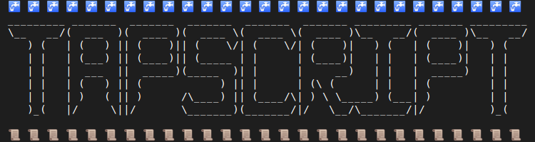

This is the sixth in [a series of review club
meetings](./meetings-components/#taproot) on the implementation of BIP 340-342.

This week we'll look at another commit from the taproot PR (PR 19953) -
_[Implement Tapscript script validation rules (BIP
342)](https://github.com/bitcoin-core-review-club/bitcoin/commit/805a79ab)_.

## Notes

- The schnorr/taproot softfork proposal contains:

  - A new signature scheme (schnorr signatures), defined in [BIP 340](https://github.com/bitcoin/bips/blob/master/bip-0340.mediawiki)
  - A new way to commit to a script or tree of scripts embedded within a public key (taproot), defined in [BIP 341](https://github.com/bitcoin/bips/blob/master/bip-0341.mediawiki)
  - A new scripting language (tapscript), defined in [BIP 342](https://github.com/bitcoin/bips/blob/master/bip-0342.mediawiki)

  This week, we're looking at the implementation of tapscript. You should read
  the specification of BIP 342 before reviewing the code, and keep a copy handy
  while you review to make sure that the implementation matches the
  specification.

- Tapscript has almost identical script semantics to [those defined in BIP
  141](https://github.com/bitcoin/bips/blob/master/bip-0141.mediawiki#New_script_semantics)
  for P2WSH spends, which themselves are almost identical to the semantics for
  pre-segwit script.

- The main differences between tapscript and P2WSH semantics are:

  - BIP 340 schnorr signature validation is used for all `OP_CHECKSIG` and
    `OP_CHECKSIGVERIFY` evaluation, with a new signature hash
    (observe the data input to the _Verify_ function in the [signature validation algorithm](https://github.com/bitcoin/bips/blob/master/bip-0342.mediawiki#signature-validation)).
  - `OP_CHECKMULTISIG` and `OP_CHECKMULTISIGVERIFY` are disabled, with their
    functionality replaced by `OP_CHECKSIGADD`.
  - Certain opcodes are redefined to mean `OP_SUCCESS` and cause validation to succeed immediately.
  - `MINIMALIF` becomes a consensus rule.

- Almost all of the new code in this commit is in the
  [src/script/interpreter.cpp
  file](https://github.com/bitcoin-core-review-club/bitcoin/commit/805a79ab#diff-be2905e2f5218ecdbe4e55637dac75f3),
  inside the `EvalScript()` interpreter, the `EvalChecksig()` signature
  verification code, and the `ExecuteWitnessScript()` and
  `VerifyWitnessProgram()` functions.

## Questions

### Specification

1. What additional data does the signature hash commit to, compared to P2WPKH
   and P2WSH signatures? Hint: you'll need to look at the _SigMsg()_ and
   _tapleaf hash_ definitions in BIP 341. You may also want to review the
   review club notes from [the session on taproot signature hashing](./17977).

2. Why are `OP_CHECKMULTISIG` and `OP_CHECKMULTISIGVERIFY` disabled in
   tapscript? How can you implement a multisig scheme in segwit v1?

3. What is the purpose of the new `OP_SUCCESS` opcodes? How does their
   functionality differ from `OP_NOP` in pre-segwit and P2WSH script?

4. Why is MINIMALIF a consensus rule in tapscript?

### Implementation

1. `EvalChecksig()` (and the functions it calls) have both a return value and
   a `success` out parameter. What are those two values used for? Under what
   circumstances can a signature validation fail, but script execution
   succeed?

2. Why does the `MAX_SCRIPT_SIZE` limit [not apply to tapscript](https://github.com/bitcoin-core-review-club/bitcoin/commit/805a79ab#diff-be2905e2f5218ecdbe4e55637dac75f3R452)?

3. Why is the [script interpreter
   loop](https://github.com/bitcoin-core-review-club/bitcoin/commit/805a79ab#diff-be2905e2f5218ecdbe4e55637dac75f3R463)
   changed from a while loop to a for loop? What is the variable `opcode_pos` used
   for?

4. Is `nOpCount` used during tapscript evaluation? Why/why not?

5. What happens if a tapscript contains an `OP_CHECKSIG`, `OP_CHECKSIGVERIFY`
   or `OP_CHECKSIGADD` with a public key that isn't a 32 byte array? Where is
   that behaviour specified in the BIPs? Where is it implemented in the code?

6. What happens if a tapscript contains an `OP_CHECKSIG`, `OP_CHECKSIGVERIFY`
   or `OP_CHECKSIGADD` with an empty signature? Where is that behaviour
   specified in the BIPs? Where is it implemented in the code?

7. Why are stack size limits [checked inside
   ExecuteWitnessScript()](https://github.com/bitcoin-core-review-club/bitcoin/commit/805a79ab#diff-be2905e2f5218ecdbe4e55637dac75f3R1810-R1813)?

## Meeting Log


19:00 <@jnewbery> #startmeeting
19:00 <@jnewbery> Hi folks! Welcome to Bitcoin Core PR Review Club. Feel free to say 'hi' to let everyone know you're here.
19:00 <pinheadmz> hi
19:00 <emzy> hi
19:00 <jonatack> bonsoir!
19:00 <robot-dreams> hi
19:00 <elle> hi
19:00 <vaguely> hi
19:00 <jesseposner> hi
19:00 <@jnewbery> Is it anyone's first time at review club?
19:00 <stacie> hi
19:01 <b10c> Would anyone be interested in an auto-generated .ics calendar file for the PR review club with proper title and so on? I need something in my calendar otherwise I miss the meeting every other week.
19:01 <sipa> hi
19:01 <b10c> hi
19:01 <michaelfolkson> hi
19:01 <nir> hi! first time here
19:01 <@jnewbery> b10c: I think wumpus made a calendar with all of the Bitcoin Core meetings, including review club
19:01 <buzz08> hi, this is my first time too :-)
19:01 <@jnewbery> Yay! Welcome. We love new participants
19:01 <vaguely> welcome to the PR review party, nir buzz08
19:01 <felixweis> hi!
19:02 <@jnewbery> Before we begin, a reminder that I'm always looking for hosts for review club and suggestions of what PRs to cover. Feel free to message me anytime if you think you might want to host at some point.
19:02 <Sound> Hello!
19:02 <@jnewbery> You don't need to be the world's foremost authority on something to host. Just commit to spending some time writing notes and questions (I'll help!), and then show up and guide other people through what you've learned and what's interesting about the PR.
19:02 <nir> vaguely thank you!
19:02 <b10c> jnewbery: thanks! will have a look at that
19:02 <@jnewbery> Ok, onto this week's PR. Today we'll be talking about ...
19:02 <@jnewbery> 🚰 🚰 🚰 🚰 🚰 🚰 🚰 🚰 🚰 🚰 🚰 🚰 🚰 🚰 🚰 🚰 🚰 🚰 🚰 🚰 🚰 🚰 🚰 🚰 🚰 🚰 🚰
19:02 <@jnewbery> _________ _______  _______  _______  _______  _______ _________ _______ _________
19:02 <@jnewbery> \__   __/(  ___  )(  ____ )(  ____ \(  ____ \(  ____ )\__   __/(  ____ )\__   __/
19:02 <@jnewbery>    ) (   | (   ) || (    )|| (    \/| (    \/| (    )|   ) (   | (    )|   ) (
19:02 <@jnewbery>    | |   | (___) || (____)|| (_____ | |      | (____)|   | |   | (____)|   | |
19:02 <@jnewbery>    | |   |  ___  ||  _____)(_____  )| |      |     __)   | |   |  _____)   | |
19:02 <@jnewbery>    | |   | (   ) || (            ) || |      | (\ (      | |   | (         | |
19:02 <@jnewbery>    | |   | )   ( || )      /\____) || (____/\| ) \ \_____) (___| )         | |
19:03 <@jnewbery>    )_(   |/     \||/       \_______)(_______/|/   \__/\_______/|/          )_(
19:03 <@jnewbery>                                                                                  
19:03 <@jnewbery> 📜 📜 📜 📜 📜 📜 📜 📜 📜 📜 📜 📜 📜 📜 📜 📜 📜 📜 📜 📜 📜 📜 📜 📜 📜 📜 📜
19:03 <@jnewbery> Notes and questions are in the normal place: https://bitcoincore.reviews/19953
19:03 <pinheadmz> OH YES DUDE +1,000,000
19:03 <@jnewbery> This is our sixth session on the schnorr/taproot implementation. You can see notes/questions/logs from all the previous meetings here: https://bitcoincore.reviews/meetings-components/#taproot
19:03 <felixweis> amazing!
19:03 <jonatack> 👏
19:03 <@jnewbery> pinheadmz: thanks, you're an inspiration
19:03 <@jnewbery> First things first. Who's had a chance to review the commit (y/n). Absolutely no problem if you didn't have time this week. We'll walk though the changes together.
19:03 <pinheadmz> y
19:03 <felixweis> y
19:03 <emzy> n
19:04 <b10c> n
19:04 <robot-dreams> ish
19:04 <Paul52> n
19:04 <jesseposner> n
19:04 <stacie> n
19:04 <dome> n
19:04 <benthecarman> y
19:04 <sipa> y
19:04 <nir> y
19:04 <elle> y-ish
19:04 <jonatack> y
19:04 <michaelfolkson> y
19:04 <@jnewbery> that's great. Lots of review
19:04 <@jnewbery> alright, let's get to it
19:04 <@jnewbery> 1. What additional data does the signature hash commit to, compared to P2WPKH and P2WSH signatures? Hint: you’ll need to look at the SigMsg() and tapleaf hash definitions in BIP 341. You may also want to review the review club notes from the session on taproot signature hashing.
19:05 <@jnewbery> BIP: https://github.com/bitcoin/bips/blob/master/bip-0341.mediawiki
19:05 <Murch> n
19:05 <pinheadmz> for one i believe it commits to all the input values for the entire tx
19:05 <robot-dreams> Input amounts (so you can be confident of the fee when signing)
19:05 <benthecarman> input amounts and spks
19:05 <sipa> robot-dreams: which input amounts?
19:06 <pinheadmz> and i think we commit to the scriptPubKey which segwit v0 didnt ?
19:06 <@jnewbery> oops that was the taproot bip. tapscript is here: https://github.com/bitcoin/bips/blob/master/bip-0342.mediawiki (you'll need both)
19:06 <pinheadmz> sipa all input amounts! unless SIGHASH_ANYONECANPAY is set
19:06 <sipa> pinheadmz: indeed!
19:07 <sipa> the sighash scheme is mostly in BIP341, with some additions in BIP342
19:07 <michaelfolkson> And the leaf version. Obviously that didn't exist for SegWit v0
19:07 <sipa> pinheadmz: and indeed, bip143 (the segwit v0 sighash scheme) didn't commit to the scriptPubKey
19:07 <@jnewbery> can anyone give me a link/reference for where the sighash is defined?
19:07 <sipa> https://github.com/bitcoin/bips/blob/master/bip-0341.mediawiki#common-signature-message
19:08 <@jnewbery> that's it sipa!
19:08 <robot-dreams> sipa: previous output spent by a particular input, as well as serialization of all spent output amounts in the transaction?
19:08 <felixweis> thats quite the commitment!
19:08 <michaelfolkson> Does SegWit v0 commit to the size of the script?
19:08 ⚡ michaelfolkson checks
19:08 <pinheadmz> oh yeah for bip342 theres also the leaf version and key version which is always 0x00 for now
19:08 <sipa> michaelfolkson: which script? :)
19:09 <@jnewbery> we covered the taproot signature hash in a previous review club (https://bitcoincore.reviews/17977). There are also some other things that go into the hash when we're doing a script path spend. Can anyone find the reference for that?
19:09 <sipa> robot-dreams: right; bip143 already committed to the input amount being spent; bip341 changes that to cover _all_ input amounts of the transaction, in every input
19:09 <michaelfolkson> Trick question sipa? The Tapscript output script?
19:10 <robot-dreams> Thanks, that was not clear before
19:10 <sipa> michaelfolkson: the one being spent?
19:10 <sipa> michaelfolkson: or the one(s) being created?
19:10 <sipa> robot-dreams: and not just the amounts, all _all_ scriptpubkeys of the outputs being spent
19:11 <@jnewbery> it's here: https://github.com/bitcoin/bips/blob/master/bip-0342.mediawiki#signature-validation. You can see that the signature hash is also committing to the tapleaf_hash, key_version and codesep_pos
19:12 <@jnewbery> ok, next question. 2. Why are OP_CHECKMULTISIG and OP_CHECKMULTISIGVERIFY disabled in tapscript? How can you implement a multisig scheme in segwit v1?
19:12 <jonatack> https://github.com/bitcoin/bips/blob/master/bip-0342.mediawiki#cite_ref-3-0
19:12 <pinheadmz> the BIP author (ahem) says those op codes are inefficeint
19:12 <nir> because they're inefficient
19:12 <benthecarman> they are replaced with OP_CHECKSIGADD
19:12 <pinheadmz> i suppose its because you dont know until you get to the end of the script if youve reached the threshold?
19:13 <jesseposner> https://github.com/bitcoin/bips/blob/master/bip-0342.mediawiki#design
19:13 <pinheadmz> checksigadd does one at a time and drops a counter back on the stack
19:13 <pinheadmz> er, increments a counter
19:13 <sipa> why are they inefficient?
19:13 <@jnewbery> great. Yes, lots of good answers. checkmultisig is inefficient. It also makes batch validation difficult or impossible I believe
19:13 <pinheadmz> i was wondering if it also has something to do with batch verification
19:13 <jonatack> ugh, clicked on the wrong link, apologies https://github.com/bitcoin/bips/blob/master/bip-0342.mediawiki#cite_note-2
19:14 <pinheadmz> yeah but with op_CMS you still have an array of signatures on the input
19:14 <sipa> indeed, they're inherently incompatible with batch validation
19:14 <pinheadmz> sipa is it because op_checksig/multisig use a different transaction digest?
19:15 <sipa> in batch validation you need to know ahead of time which (msg,pubkey,sig) triplets are going to have to be valid, and which won't
19:15 <pinheadmz> and re: batch - im unclear what actually changes to make the new scheme more cmpatible
19:15 <pinheadmz> ah
19:15 <sipa> OP_CMS can't do that, as the same signature is tried against multiple pubkeys
19:15 <pinheadmz> AHHHHhhhhhh 💡
19:15 <sipa> so it would require a combinatorial explosion
19:15 <michaelfolkson> sipa: The one being spent
19:16 <pinheadmz> i didnt realize that - so for CMS the order of pubkeys/signatures is not enforced?
19:16 <sipa> michaelfolkson: clearly segwitv0 does not commit to the taproot output being spent ;)
19:16 <@jnewbery> Anyone got an answer for: How can you implement a multisig scheme in segwit v1?
19:16 <sipa> pinheadmz: the order is enforced, but the combination isn't
19:16 <elle> i think the order is enforced but there is a placeholder for the missing ones?
19:16 <pinheadmz> oh right thanks elle / sipa
19:16 <sipa> elle: no placeholder, that's the problem!
19:17 <sipa> if there was a placeholder we'd be golden for batch validation
19:17 <nir> using Using a single OP_CHECKSIGADD-based script is an alternative
19:17 <robot-dreams> jnewbery: Do you have to use something like musig along CHECKSIGAD to get multisig in v1?
19:17 <b10c> jnewbery: MuSig?
19:17 <sipa> pinheadmz: if you have 2-of-3 with pubkeys [pA, pB, pC], you can spend it with sigs [sA, aB], [sA, sC], or [sB, sC]
19:17 <felixweis> in case you can't combine with MuSig?
19:17 <@jnewbery> nir: yes, we can create a tapscript with OP_CHECKSIGADD and all the pubkeys
19:17 <sipa> OP_CMS just tries all combinations
19:17 <michaelfolkson> No robot-dreams. You don't have to
19:17 <jesseposner> MuSig requires Schnorr
19:17 <pinheadmz> with musig you wnd up with one single signature, so that is actually different than checksigadd
19:18 <pinheadmz> if you are using musig you might not even need tapscript! (key path could suffice)
19:18 <@jnewbery> robot-dreams b10c: yes! an aggregation scheme like MuSig is another way to create a multisig scheme
19:18 <sipa> jesseposner: thankfully, BIP342 disables all ECDSA check opcodes and replaces them with Schnorr ones
19:18 <sipa> jnewbery: i suggest reading rationale 5 in BIP342
19:19 <elle> sipa: i meant op_checksig add. doesnt it have a placeholder?
19:19 <sipa> elle: ah, yes!
19:19 <sipa> sorry, i thought you were talking about OP_CMS
19:19 <elle> sipa: ok cool :)
19:19 <@jnewbery> so that's two ways of having a multisig scheme. Any others?
19:19 <nir> Native Schnorr threshold signatures?
19:20 <@jnewbery> nir: that's what I meant above by a aggregation scheme.
19:20 <b10c> jnewbery: I suppose you could do e.g. a 1-of-2 by having two branches with a single key spend each?
19:20 <sipa> jnewbery: i think there is an important distinction
19:20 <nir> ah, got it
19:20 <felixweis> only these 2
19:20 <michaelfolkson> MuSig-DN
19:20 <michaelfolkson> MuSig2
19:20 <sipa> michaelfolkson: doesn't change the script
19:21 <sipa> that's just signing protocol differences
19:21 <@jnewbery> b10c: yes, you can break down the different key combinations into different scripts in the tree
19:21 ⚡ michaelfolkson checking what question we're answering again
19:21 <sipa> you could have a merkle tree where every leaf is a K-of-K MuSig aggregate, or you can use a threshold scheme and just have the key path be the key for the K-of-N entirely (which arguably doesn't involve tapscript at all)
19:22 <robot-dreams> Sorry, I'm a little lost and I have a basic question. Unlike CHECKSIG, the new CHECKSIGADD involves an additional CScriptNum value. What's the context for this?
19:22 <willcl_ark> Hi! Sorry to miss the beginning of the review; going to try and read the backlog and catch up...
19:23 <@jnewbery> sipa: right. Which is why the question was framed as 'multisig scheme in segwit v1'. You can use a single tapscript, a tree of tapscripts, or just the keypath spend (no tapscripts at all)
19:23 <sipa> robot-dreams: OP_CHECKSIGADD is literally just a shorthand for OP_ROT OP_SWAP OP_CHECKSIG OP_ADD
19:23 <@jnewbery> as sipa pointed out, there's a good summary here: https://github.com/bitcoin/bips/blob/master/bip-0342.mediawiki#cite_note-5
19:23 <sipa> robot-dreams: because that's an expected common pattern that people would use to replace OP_CHECKMULTISIG
19:23 <pinheadmz> and amazingly, OP_ROT rotates exactly three elements, which is perfect for this use case.
19:23 <@jnewbery> and I think Murch might also have written something about implementing multisignature schemes in taproot
19:24 <jonatack> https://medium.com/@murchandamus/2-of-3-multisig-inputs-using-pay-to-taproot-d5faf2312ba3
19:24 <@jnewbery> 3. What is the purpose of the new OP_SUCCESS opcodes? How does their functionality differ from OP_NOP in pre-segwit and P2WSH script?
19:24 <@jnewbery> thanks jonatack!
19:24 <glozow> Script upgradeability!
19:24 <pinheadmz> robot-dreams in english: every successful sig verification increments this counter by 1, then the number is returned to the stack
19:24 <pinheadmz> its like a small Katamari ball rolling over your signatures
19:24 <michaelfolkson> NOP was ignored. SUCCESS results in success instantly
19:25 <sipa> robot-dreams: so you can write a 4-of-5 multisig as "pA CS pkB CSA pkC CSA pkD CSA pkE CSA 4 EQUAL"
19:25 <vaguely> pinheadmz nice analogy
19:25 <robot-dreams> OH!! I didn't realize you would typically use it multiple times. That's why I thought you could ONLY use something like musig.
19:25 <sipa> robot-dreams: tapscript is, after, still a script
19:25 <@jnewbery> michaelfolkson: yes, exactly
19:25 <robot-dreams> That means CSA doesn't add any fancy Schnorr stuff, you could have also just used CS
19:25 <robot-dreams> if you wanted to use musig?
19:26 <robot-dreams> OK I was very confused but I think I'm good now, thanks
19:26 <@jnewbery> why would we want OP_SUCCESS instead of OP_NOP?
19:26 <pinheadmz> robot-dreams all sigs in taproot/tapscrtpt still use schnorr
19:26 <robot-dreams> OP_SUCCESS makes the entire script succeed just by its presence
19:26 <robot-dreams> That is much nicer for soft fork upgrades in the future
19:26 <michaelfolkson> I think glozow answered that jnewbery
19:26 <jesseposner> OP_NOP only has read access to the stack, OP_SUCCESS also has write access (https://github.com/bitcoin/bips/blob/master/bip-0342.mediawiki#cite_ref-1-0)
19:26 <sipa> robot-dreams: yes, ideally you have just one signature check in a script, and it's a musig aggregate or native threshold
19:26 <felixweis> OP_SUCCESS instead of NOP allows for more versatile future softforking
19:26 <pinheadmz> jesseposner nice detail!
19:26 <@jnewbery> ah yes! Thanks glozow. Can you expand? Why is it better for upgradeability?
19:27 <sipa> robot-dreams: but musig adds complication for signers, and thresholds even more... so people may want to use individual checksigs/checksigadds instead
19:27 <@jnewbery> jesseposner: good answer!
19:27 <glozow> er, upgrades = restrict spending rules. If we have an automatic success now, it allows lots of flexibility for upgrades?
19:28 <glozow> I think i read something about being able to write to the stack with OP_SUCCESS whereas for the NOPS, you can only (1) fail or (2) continue without changing the stack?
19:28 <@jnewbery> OP_NOP is rather limited in the semantics it can be repurposed for. It must leave the stack unchanged. OP_SUCCESS can be repurposed to any semantic
19:28 <glozow> sorry I didn't prep very well for  today :'(
19:28 <sipa> glozow: that's exactly it
19:28 <@jnewbery> glozow: exactly!
19:28 <sipa> NOPs cannot be redefined to do anything, except failing'
19:28 <felixweis> for instance future opcodes could read/consume/write 1 or more different stack elements
19:29 <sipa> they can't make any observable state changes, because that could result in non-softfork behavior
19:29 <@jnewbery> Last question on the spec, then we can move onto the implementation.
19:29 <@jnewbery> 4. Why is MINIMALIF a consensus rule in tapscript?
19:29 <pinheadmz> malleability!
19:29 <michaelfolkson> It was a consensus rule for SegWIt v0 too though right?
19:30 <@jnewbery> pinheadmz: I applaud your enthusiasm for malleability, but your answer could use a bit more detail
19:30 <pinheadmz> sorry had to get the door lol
19:30 <pinheadmz> ok
19:30 <pinheadmz> becsuse lots of vsalues can be "true:
19:30 <pinheadmz> so a script that computes IF (9999999) will be the same result as IF(1)
19:30 <@jnewbery> michaelfolkson: no, it was added as a standardness rule for segwit v0, but is not consensus
19:31 <michaelfolkson> Introduced in 2016: https://github.com/bitcoin/bitcoin/pull/8526
19:31 <jonatack> "Why make MINIMALIF consensus? This makes it considerably easier to write non-malleable scripts that take branch information from the stack." https://github.com/bitcoin/bips/blob/master/bip-0342.mediawiki#cite_note-3
19:31 <pinheadmz> minimalif is, i believe already a mempool policy rule
19:31 <sipa> yeah, that was something we learned when working on miniscript
19:31 <robot-dreams> Without MINIMALIF, would you be able to change the stack values in this way without invalidating any signatures?
19:31 <glozow> pinheadmz yup it is
19:31 <sipa> it's virtually impossible to write nontrivial malleability-resistant scripts without huge hacks
19:32 <@jnewbery> cool. Seems like you've all done a very close reading of the spec. That's great because now we can check that it was implemented properly
19:32 <willcl_ark> Otherwise people can replace the top stack element with another True or False value
19:32 <@jnewbery> any final questions on the spec before we move on to implementation?
19:32 <sipa> willcl_ark: in some cases at least, yes
19:32 <pinheadmz> bc input scripts (which contain signatures) can not be signed, and therefore are not invalidated if they are changed in flight, like a man-in-the-middle-attack
19:32 <@jnewbery> 1. EvalChecksig() (and the functions it calls) have both a return value and a success out parameter. What are those two values used for? Under what circumstances can a signature validation fail, but script execution succeed?
19:33 <pinheadmz> i think we covered this in a previous meeting
19:34 <pinheadmz> it can actually be ok for a sig to fail
19:34 <elle> i think sig validation can fail during checksigadd when we process the placeholder signatures
19:34 <@jnewbery> We're looking at this function and friends: https://github.com/bitcoin-core-review-club/bitcoin/commit/805a79abea841f8da6c219f7e649f7084c8b6386#diff-a0337ffd7259e8c7c9a7786d6dbd420c80abfa1afdb34ebae3261109d9ae3c19R416
19:34 <pinheadmz> maybe the script requires a checksig to return false
19:34 <@jnewbery> elle: exactly right
19:34 <sipa> elle: define "fail" :)
19:35 <michaelfolkson> Requires pinheadmz?!
19:35 <michaelfolkson> When requires?
19:36 <pinheadmz> so maybe key/msg/sig do not match, thats opchecksig -> false
19:36 <sipa> michaelfolkson: e.g. a 2-of-3 policy using CSA will require one signature check to return false
19:36 <pinheadmz> maybe then theres an IF branch that follows som logic if false
19:36 <pinheadmz> but if your pubkey is 100 bytes for example, thats not just a checksig->false, thats an error
19:36 <sipa> pinheadmz: almost
19:36 <robot-dreams> I think one example where signature validation fails but script execution can succeed (according to `bool success` and return value) is when the signature is empty
19:36 <sipa> CS/CSA have a tri-state result: good signature, bad signature, abort script
19:37 <elle> sipa: hmmm will have to think about that one. But i mean 'result in checksigadd adding 0'
19:37 <sipa> elle: exactly
19:37 <pinheadmz> sipa what am i missing ?
19:37 <sipa> there is only one way to get that: the signature has to be empty
19:38 <@jnewbery> robot-dreams: right - an empty signature is used in cases where we want the signature check to fail, and script execution to continue
19:38 <pinheadmz> aha
19:38 <sipa> pinheadmz: an actually non-empty invalid signature will abort the script
19:38 <@jnewbery> 2. Why does the MAX_SCRIPT_SIZE limit not apply to tapscript?
19:38 <michaelfolkson> I thought CSA was still minimum of 2 in 2-of-3. Not exactly 2
19:38 <sipa> it has to, anything else is not compatible with batching
19:38 <sipa> michaelfolkson: it is whatever you want it to be
19:38 <sipa> michaelfolkson: it's a script, you write it yourself
19:38 <felixweis> oh! now i see. i was thiking in sipas example before it was a typo but yeah now it makes sense. CS vs CSA
19:39 <sipa> michaelfolkson: e.g. A CS B CSA C CSA D CSA 4 EQUAL
19:39 <elle> Because we never need to reveal the entire script. Only its TaggedHash and merkle proof. So script size no longer matters.
19:39 <@jnewbery> https://github.com/bitcoin-core-review-club/bitcoin/commit/805a79abea841f8da6c219f7e649f7084c8b6386#diff-a0337ffd7259e8c7c9a7786d6dbd420c80abfa1afdb34ebae3261109d9ae3c19R452
19:39 <sipa> elle: eh no, the full script gets revealed
19:39 <sipa> but only the executed one
19:39 <robot-dreams> BIP 342 says "Since there is no scriptCode directly included in the signature hash (only indirectly through a precomputable tapleaf hash), the CPU time spent on a signature check is no longer proportional to the size of the script being executed."
19:39 <sipa> if the merkle tree contains multiple scripts, you only reveal the one you actually use
19:39 <robot-dreams> However, I'm not sure how / when you could do such precomputation
19:39 <elle> sipa: oh right! sorry
19:40 <sipa> robot-dreams: once per script
19:40 <sipa> it's already implemented
19:41 <pinheadmz> jnewbery i have a guess about max script size - because we have this other concept of a scriptop budget now
19:41 <pinheadmz> and the max block size / weight is still obviously a hard rule
19:41 <michaelfolkson> You'd never want to do that though right... haha. I demand one of my signatures fail. Otherwise fail the script.
19:41 <pinheadmz> but since this feels like a relaxation of a size rule im scratching my head over the soft-forkedness of it
19:42 <sipa> michaelfolkson: i don't see why not
19:42 <@jnewbery> robot-dreams pinheadmz: yes, you're right. Rationale is here: https://github.com/bitcoin/bips/blob/master/bip-0342.mediawiki#cite_note-9
19:42 <pinheadmz> i guess because for old nodes it just looks like a witness item, not necessarily s script
19:42 <sipa> michaelfolkson: there is no point in allowing more than 2 sigs for a 2-of-3 multisig... that's just adding cost and malleability
19:42 <robot-dreams> sipa: Are you referring to the precomputation in `VerifyTaprootCommitment`?
19:43 <sipa> robot-dreams: yes, and it being passed through to the script execution using ScriptExecutionData::m_tapleaf_hash
19:43 <Murch> pinheadmz: Since either only a signature is revealed for the key path and exactly one tap branch and one script in a leaf for a script path spend, why do you think maxscriptsize is hard?
19:44 <Murch> I'm not sure what you are thinking about
19:44 <sipa> pinheadmz: max script size is enforced (for witness v0) at script execution time
19:45 <@jnewbery> We're down to 15 minutes, so I'm going to keep moving through the questions. You're always welcome to ask questions about what we've been talking about before.
19:45 <sipa> for other witness versions, no script is executed, so no limit applies
19:45 <@jnewbery> 3. Why is the script interpreter loop changed from a while loop to a for loop? What is the variable opcode_pos used for?
19:45 <@jnewbery> https://github.com/bitcoin-core-review-club/bitcoin/commit/805a79abea841f8da6c219f7e649f7084c8b6386#diff-a0337ffd7259e8c7c9a7786d6dbd420c80abfa1afdb34ebae3261109d9ae3c19R463
19:45 <robot-dreams> One more thing I don't understand, previously, what was the expensive operation we were trying to avoid with a script size limit?
19:46 <pinheadmz> jnewbery i believe this is because the positon of the last OP_CODESEPARATOR is commited to by the signature
19:46 <michaelfolkson> Because now we know how many times we want to loop. No reason to switch otherwise
19:46 <sipa> robot-dreams: well, you'll need to ask satoshi i'm afraid
19:46 <@jnewbery> pinheadmz: yep
19:46 <sipa> there are justifications for it, but the exact rule and its design goals were never documented
19:47 <sipa> michaelfolkson: no
19:47 <michaelfolkson> Hmm do tell
19:47 <@jnewbery> we need to know what position we're in, so when we hit an OP_CODESEPARATOR we can save the position
19:47 <@jnewbery> because that's committed to in the signature hash
19:47 <pinheadmz> Murch i confused myself in thinking that a V1 script would be subject to same rules as V0 script. but its not, because on the blockchain its all just witness stack items. the v0 rules decide something is a script and impose a max limit.
19:48 <Murch> pinheadmz: I see
19:48 <jonatack> the opcode position is described here: https://github.com/bitcoin/bips/blob/master/bip-0342.mediawiki#signature-validation
19:48 <@jnewbery> 4. Is nOpCount used during tapscript evaluation? Why/why not?
19:48 <jonatack> under "codesep_pos" i believe
19:48 <robot-dreams> Regarding the note "the CPU time spent on a signature check is no longer proportional to the size of the script being executed" from BIP 342, where was the previous signature check that was proportional to the size of the script being executed?
19:49 <jonatack> jnewbery: didn't prep but seems no
19:49 <jonatack> from quick look at the code
19:49 <@jnewbery> jonatack: you answered the easy question correctly :)
19:50 <@jnewbery> Why isn't nOpCount used for tapscript?
19:50 <robot-dreams> I believe the note about nOpCount is here: https://github.com/bitcoin/bips/blob/master/bip-0342.mediawiki#cite_note-10
19:50 <jonatack> it's used in OP_CHECKMULTISIGVERIFY
19:50 <jonatack> which is disabled in per bip342
19:51 <sipa> robot-dreams: BIP143 includes the scriptCode in its hash, which means that every sigcheck needs to hash the entire script being hashed
19:51 <@jnewbery> robot-dreams: yes! "An opcode limit only helps to the extent that it can prevent data structures from growing unboundedly during execution (both because of memory usage, and because of time that may grow in proportion to the size of those structures). The size of stack and altstack is already independently limited. By using O(1) logic for OP_IF, OP_NOTIF, OP_ELSE, and OP_ENDIF as
19:51 <@jnewbery> suggested here and implemented here, the only other instance can be avoided as well."
19:51 <sipa> robot-dreams: so you could create a script whose execution time is proportional to its length (in witness v0)
19:52 <sipa> robot-dreams: another example is that until some time ago, OP_IF/OP_ELSE behavior was O(n) in the depth of nested IFs
19:52 <robot-dreams> sipa: Aren't you still doing this after BIP 341, since the tapleaf hash involves the entire script being executed?
19:52 <jonatack> that case appears to be line 476 after (sigversion == SigVersion::BASE || sigversion == SigVersion::WITNESS_V0)
19:52 <sipa> robot-dreams: no, because it's precomputed
19:52 <jonatack> if (opcode > OP_16 && ++nOpCount > MAX_OPS_PER_SCRIPT)
19:52 <sipa> that script hashing is done once per script, not per signature
19:52 <@jnewbery> jonatack: nOpCount is incremented for _every_ opcode encountered during script execution
19:53 <@jnewbery> (for pre-tapscript)
19:53 <@jnewbery> 5. What happens if a tapscript contains an OP_CHECKSIG, OP_CHECKSIGVERIFY or OP_CHECKSIGADD with a public key that isn’t a 32 byte array? Where is that behaviour specified in the BIPs? Where is it implemented in the code?
19:53 <jonatack> yes, pre-tapscript
19:54 <robot-dreams> If the public key is empty, then the script fails and terminates immediately; if it's any other size besides 0 or 32 bytes, signature validation is assumed to be successful unless the SCRIPT_VERIFY_DISCOURAGE_UPGRADABLE_PUBKEYTYPE flag is set
19:54 <@jnewbery> robot-dreams: yes. And when is that flag set/unset?
19:54 <pinheadmz> another upgrade path
19:54 <pinheadmz> i think james prestwich wrote something enumerating all the taproot/script upgrade paths
19:54 <@jnewbery> pinheadmz: Yet Another Upgrade Mechanism
19:55 <willcl_ark> so it lets you add new sighashes?
19:55 <pinheadmz> willcl_ark signature schemese
19:55 <willcl_ark> ah ok
19:55 <michaelfolkson> https://bitcoin.stackexchange.com/questions/96951/what-are-the-different-upgradeability-features-in-the-bip-taproot-bip-341-prop
19:55 <@jnewbery> willcl_ark: https://github.com/bitcoin/bips/blob/master/bip-0342.mediawiki#cite_note-6
19:55 <pinheadmz> so without changing anything else, if you have a signature scheme that requires a 45-byte public key that can be soft forked in just using the pubkey size as the flag
19:55 <emzy> nice
19:56 <pinheadmz> p.s. sipa any vague ideas or examples of how this could be used? (other schemese?)
19:56 <@jnewbery> 6. What happens if a tapscript contains an OP_CHECKSIG, OP_CHECKSIGVERIFY or OP_CHECKSIGADD with an empty signature? Where is that behaviour specified in the BIPs? Where is it implemented in the code?
19:56 <sipa> pinheadmz: ANYPREVOUT
19:56 <willcl_ark> jnewbery: does this mean that tagging has been accepted for oSIGHASH_NOINPUT? I seem to recall some debate around that...
19:56 <sipa> for example uses it think
19:56 <willcl_ark> wait, I'm confusing with ANYPREVOUT.
19:56 <@jnewbery> willcl_ark: I
19:57 <robot-dreams> pinheadmz: jnewbery: I don't understand the question, isn't SCRIPT_VERIFY_DISCOURAGE_UPGRADABLE_PUBKEYTYPE "policy" so nodes can set that flag however they want?
19:57 <pinheadmz> sipa hm, because bip341/2 commit to too much speicifc data from the prevout ?
19:57 <michaelfolkson> ANYPREVOUT is NOINPUT updated willcl_ark
19:57 <@jnewbery> 'm afraid I don't know the latest on SIGHASH_ANYPREVOUT
19:57 <pinheadmz> robot-dreams that is correct
19:57 <willcl_ark> :lightbulb.gif
19:57 <pinheadmz> robot-dreams so a 45 byte pubkey would be allowed in a block
19:57 <sipa> pinheadmz: you can't change sighashing for existing keys
19:57 <pinheadmz> but we dont really want nodes accepting to mempool or relaying without really understanding whats going on
19:58 <@jnewbery> robot-dreams: exactly. We set that flag as policy, so unconfirmed transactions with non 32-byte pubkeys would fail, but would be accepted if included in a block
19:58 <sipa> pinheadmz: so you either add new opcodes for the new sighash script, or you introduce them using a new pubkey type
19:58 <pinheadmz> sipa so anyprevout could still use bip340-2 all exactly the same but just toss an extra byte on the end of the pubkey?
19:58 <stacie> for the q on where the code is for when a tapscript contains a pubkey that isn't a 32 byte array, I believe it's in the EvalChecksigTapscript() function https://github.com/bitcoin-core-review-club/bitcoin/commit/805a79abea841f8da6c219f7e649f7084c8b6386#diff-a0337ffd7259e8c7c9a7786d6dbd420c80abfa1afdb34ebae3261109d9ae3c19R395
19:58 <sipa> pinheadmz: yes
19:58 <pinheadmz> nice im up to three 💡 's today
19:59 <robot-dreams> stacie: Agreed, makes sense to me!
19:59 <@jnewbery> stacie: that's it!
19:59 <sipa> stacie: a few lines below your link, but indeed
19:59 <@jnewbery> ok, that's about time. The last question is left as an exercise for the reader
20:00 <jonatack> i wish ya'll would post filenames and linenos instead of links (GitHub loadly veerrryyy slowly for me)
20:00 <@jnewbery> oops, yes it's the else branch below that
20:00 <@jnewbery> jonatack: sorry, all the links are in interpreter.cpp today, the line number is the last few characters of the URL
20:00 <stacie> ah! that's correct :)
20:00 <pinheadmz> good jam everyone! thanks as always 🧠 jnewbery sipa
20:01 <vaguely> ty!
20:01 <@jnewbery> thanks all. Let's call it there
20:01 <Sound> Thanks! :jnewbery
20:01 <@jnewbery> #endmeeting
20:01 <robot-dreams> Thanks!
20:01 <jesseposner> thanks!
20:01 <glozow> thanks jnewbery!
20:01 <sipa> thanks for hosting, jnewbery!
20:01 <b10c> Thanks!
20:01 <felixweis> thanks!
20:01 <willcl_ark> thanks  all!
20:01 <michaelfolkson> Thanks jnewbery for doing aaaalll 6 Taproot sessions. Sad we can't do another 6!
20:01 <stacie> thanks jnewbery!
20:01 <emzy> Thanks all!
20:01 <jonatack> thanks!
20:01 <elle> that was great! thanks!
20:01 <buzz08> Thanks everybody. It was great to get to know so much stuff for the first time.
20:01 <@jnewbery> thanks for coming sipa!
20:01 <michaelfolkson> And thanks sipa for providing content for 6 PR review club sessions!
20:02 <willcl_ark> it'll be merged this week so we can do the next session on activation ;)
20:02 <nir> thanks everyone!
20:02 <michaelfolkson> The best way to get rid of sipa is to move onto activation
20:02 <buzz08> :-D
20:02 <sipa> michaelfolkson: i do hope there are not another 120 taproot sessions
20:03 <michaelfolkson> 120 Taproot activation sessions
20:03 ⚡ sipa explodes
20:03 <michaelfolkson> Haha
20:03 <jonatack> jnewbery: yes, i should have been parsing those github links rather than waiting a minute for the page to load
20:04 <willcl_ark> can't get the filename from them so easliy though
20:04 <@jnewbery> jonatack: it's annoying that the file name doesn't show up in them, but we were only in one file today
20:07 <robot-dreams> Can I follow up about MAX_SCRIPT_SIZE / precomputation? I think I'm still missing a lot of context about that.
20:07 <sipa> robot-dreams: happy to discuss
20:07 <robot-dreams> Thanks! So I think the basic pieces are, "when do we do signature checks" and "when do we call VerifyTaprootCommitment to precompute the tapleaf hash".
20:08 <robot-dreams> One guess is that we do signature checks much more often than calling VerifyTaprootCommitment, and that would resolve my confusion
20:11 <sipa> robot-dreams: yes, of course
20:12 <sipa> robot-dreams: VerifyTaprootCommitment is called once per script
20:12 <sipa> a script can contain many CS/CSA/CSV opcodes
20:14 <robot-dreams> Oh!! So we're trying to defend against the case where someone is like CS CS CS CS CS CS CS CS
20:15 <felixweis> there was a CS CS CS CS CS ... in the past
20:15 <robot-dreams> Am I understanding correctly that we could've made this precomputing optimization even without Taproot, but Taproot is a nice opportunity to make this change anyway?
20:15 <wumpus> jnewbery: b10c: fwiw my google calender link for all meetings: https://calendar.google.com/calendar/u/0?cid=MTFwcXZkZ3BkOTlubGliZjliYTg2MXZ1OHNAZ3JvdXAuY2FsZW5kYXIuZ29vZ2xlLmNvbQ
20:16 <emzy> sadly you need a google account for it.
20:16 <wumpus> yes, i'm not trying to promote google or anything, you don't *need* to use it at all, was just fyi
20:17 <sipa> robot-dreams: no
20:17 <sipa> robot-dreams: because the bip143 sighash script inserts the full scriptCode in every sighash
20:18 <@jnewbery> thanks wumpus!
20:22 <sipa> MuSig2: https://eprint.iacr.org/2020/1261
20:26 <robot-dreams> sipa: OK, I'm looking at `SignatureHash` vs `SignatureHashSchnorr` now. In both cases you have to include the script in what you're signing. In `SignatureHash` you include the entire script. In `SignatureHashSchnorr` you include the tapleaf hash.
20:26 <sipa> bingo
20:26 <sipa> and the tapleaf has is constant size
20:26 <robot-dreams> so for a script that's like CS CS CS CS CS, in the `SignatureHash` case it's you're doing O(n^2) work in the number of CS that you have but in the `SignatureHashSchorr` case it's O(n)
20:27 <robot-dreams> Before Taproot you couldn't make such an optimization without changing consensus
20:28 <robot-dreams> Thanks so much sipa, this is very helpful
20:29 <sipa> right
20:30 <wumpus> emzy: i could export it as an 'ical' file, dunno if that's more useful but at least it's plain text and doesn't need an account: https://0bin.net/paste/QGG9KrhE#qsJLS50Vd7bESlySDugTKh72h9CE45jR5EnvtBACtqa
20:31 <emzy> see DM
20:41 <wumpus> apparently there's an auto-generated one here... https://calendar.google.com/calendar/ical/11pqvdgpd99nlibf9ba861vu8s%40group.calendar.google.com/public/basic.ics
20:44 <jonatack> sipa: thanks for the paper

