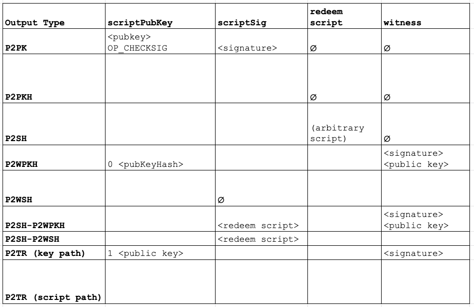
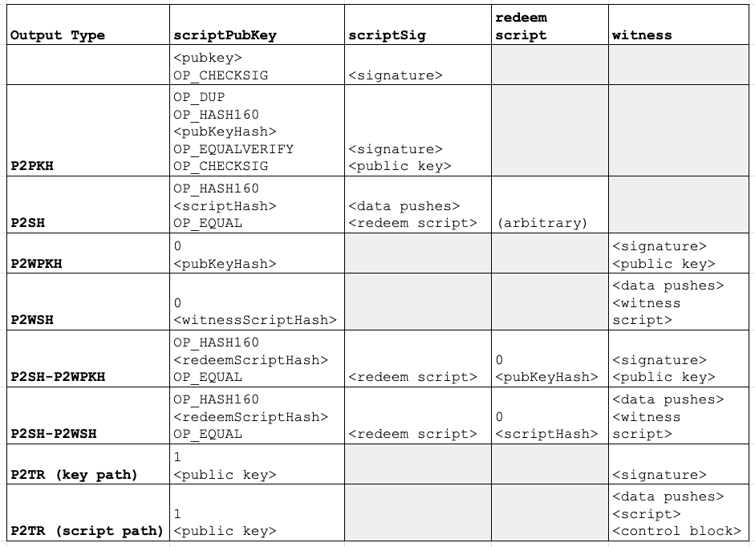

## Notes

- Bitcoin transactions encode spending conditions through a _scriptPubKey_ in outputs and a _witness_
  and _scriptSig_ in the inputs. You can read more about Bitcoin Script
[here](https://en.bitcoin.it/wiki/Script). In the functional test framework, scripts are represented
using the
[CScript](https://github.com/bitcoin/bitcoin/blob/2749613020ed96a4e9204f8b98c44524b0a62d0d/test/functional/test_framework/script.py#L423)
class, and can be initialized using an array of opcodes and byte-encoded data.

- PR [#22363](https://github.com/bitcoin/bitcoin/pull/22363) replaces many manually-constructed
  default scripts in the functional tests with helper functions provided in `script_util.py`.
It also corrects an error in the helper function,
[`get_multisig`](https://github.com/bitcoin/bitcoin/pull/22363/files#diff-cc5214ad594f50da8e14449daae7f8cff3e8d385c623b1ca13efeb3e5ca0446bR86),
in which the P2SH-wrapped P2WSH script hadn't hashed the witness script before putting it into the
scriptSig. We'll use this opportunity to review script and output types.

- To test your understanding of scripts and output types, you can try to fill out this table (Hint:
  a few cells have been pre-filled, and some cells should remain blank):

Solutions

## Questions

1. Did you review the PR? [Concept ACK, approach ACK, tested ACK, or
NACK](https://github.com/bitcoin/bitcoin/blob/master/CONTRIBUTING.md#peer-review)?

2. What do `key_to_p2pkh_script`, `script_to_p2sh_script`, `key_to_p2wpkh_script` and
    `script_to_p2wsh_script` in script\_util.py do? In what cases would we want to use or not use them?

3. Review of Terminology: Let's define script code, witness script, redeem script, scriptPubKey,
    scriptSig, witness, and witness program (some of these terms are synonymous).

4. What does the operation `OP_HASH160` do? (Hint: what does the [script
interpreter](https://github.com/bitcoin/bitcoin/blob/2749613020ed96a4e9204f8b98c44524b0a62d0d/src/script/interpreter.cpp#L431)
    do when it sees this opcode? What are the differences between the
[hashers](https://github.com/bitcoin/bitcoin/blob/2749613020ed96a4e9204f8b98c44524b0a62d0d/src/hash.h)?)

5. Review of P2PKH: to send coins to someone by public key hash (pre-segwit), what is included in
    the scriptPubKey of the output? What needs to be provided in the input when the coin is spent?

6. Review of P2SH: to send coins to someone with spending conditions encoded in a script, what is
    included in the scriptPubKey of the output? What needs to be provided in the input when the coin is
    spent? Why do we use Pay-To-Script-Hash instead of Pay-To-Script?

7. Review of P2SH-P2WSH: What is the purpose of "P2SH wrapped segwit" outputs? When a non-segwit
    node validates a P2SH-P2WSH input, what does it do?

8. Review of P2SH-P2WSH: When a node with segwit enabled validates a P2SH-P2WSH input, what does it
    do _in addition to_ the procedure performed by a non-segwit node?

9. What is wrong with the P2SH-P2WSH script
[here](https://github.com/bitcoin/bitcoin/blob/091d35c70e88a89959cb2872a81dfad23126eec4/test/functional/test_framework/wallet_util.py#L109)?
    (Hint: which variable holds the 2-of-3 multisig script itself? Which variable holds the scriptSig
    which will be included in the input?)

10. How would you verify the correctness of helper functions like `get_multisig()`? Can we add tests
    for them?

11. Can you find any other places in functional tests that could use the script\_util.py helper
    functions instead of manually creating scripts?

## Meeting Log


17:00 < glozow> #startmeeting
17:00 < jnewbery> hi!
17:00 < glozow> Welcome to PR Review Club everyone!!! Feel free to say hi :)
17:00 < b10c> hi
17:00 < sipa> hi
17:00 < glozow> lurkers welcome too
17:00 < sipa> hi, lurking
17:01 < stickies-v> hi
17:01 < glozow> we're looking at #22363 today: Use `script_util` helpers for creating P2{PKH,SH,WPKH,WSH} scripts
17:01 < glozow> Notes are here: https://bitcoincore.reviews/22363
17:01 < glozow> Did anyone get a chance to review the PR? y/n
17:02 < glozow> And did anyone get a chance to look at the notes (or fill out the table)?
17:02 < b10c> y
17:02 < jnewbery> concept y
17:03 < remember> hi
17:03 < stickies-v> concept y
17:03 < glozow> First question: What do `key_to_p2pkh_script`, `script_to_p2sh_script`, `key_to_p2wpkh_script` and `script_to_p2wsh_script` in wallet\_util.py do?
17:04 < Azorcode> Hi everyone
17:04 < svav> Hi
17:05 < b10c> specifically in wallet_util.py?
17:05 < stickies-v> I think you mean script_util.py, right?
17:05 < glozow> oh wait sorry, they are in script_util.py
17:05 < glozow> yes
17:06 < glozow> was going off of an old version of my notes
17:06 < jnewbery> They're helper functions that take a key/script and return a CScript object
17:06 < b10c> they are used to create scripts for different types of script templates
17:06 < glozow> jnewbery: b10c: yep! 
17:06 < stickies-v> I think they provide convenience wrappers around the CScript constructor, with default opcodes etc
17:06 < jnewbery> where the CScript object is a P2PKH/P2SH/etc
17:07 < glozow> stickies-v: yes!
17:08 < glozow> let's define some terminology with the word "script" in them: script code, witness script, redeem script, scriptPubKey,
17:08 < glozow>     scriptSig
17:08 < glozow> what do these mean?
17:08 < LarryRuane> script code = sequence of operations (some of which may be just pushing values on the stack)
17:09 < jnewbery> scriptPubKey - this is in the TxOut and encumbers the output with spending conditions
17:09 < b10c> scriptSig = script part in the transaction input
17:10 < remember> scriptSig predicate that satisfies the scriptPubKey
17:10 < remember> a predicate *
17:10 < glozow> jnewbery: b10c: remember: yep! those are our names for the scripts in inputs and outputs, which we can see in the code here: https://github.com/bitcoin/bitcoin/blob/master/src/primitives/transaction.h
17:10 < LarryRuane> scriptSig = script code that is placed before the scripPubKey when evaluating if an input unlocks the output
17:11 < sipa> not "placed before" since somewhere in 2010; it's evaluated first, and the resulting stack is fed as initial state for the scriptPubKey is evaluated
17:11 < jnewbery> LarryRuane: scriptCode actually has a specific meaning
17:11 < glozow> LarryRuane: I suppose we could use "script code" colloquially to mean the "code" evaluated in scripts, but scriptCode also has a meaning defined in BIP143
17:12 < sipa> it has a meaning since long before segwit
17:12 < glozow> oop 🤭
17:13 < jnewbery> here's that change in 2010: https://github.com/bitcoin/bitcoin/commit/6ff5f718b6a67797b2b3bab8905d607ad216ee21#diff-27496895958ca30c47bbb873299a2ad7a7ea1003a9faa96b317250e3b7aa1fefR1114-R1124
17:14 < glozow> okie so we still need definitions for witness script and redeem script, any takers?
17:15 < stickies-v> redeem script I would think is the full script that satisfies a p2sh?
17:16 < b10c> it's not the full scriptPubkey
17:16 < b10c> only the last data push
17:17 < glozow> stickies-v: ya i agree with that answer
17:17 < glozow> and witness script?
17:18 < b10c> a witness script belongs to an input spending a SegWit output
17:18 < glozow> (does anyone want to answer: what's a witness?)
17:18 < LarryRuane> Witness script is part of the tx input (but not included in the txid hash), and it's placed into the execution to-do list (probably using the wrong terms here) after the special segwit pattern is seen, 0,32-byte-hash
17:19 < remember> whatabout "A witness script is to segwit txns as scriptSig is to non-segwit txn" ?
17:19 < remember> accurate?
17:20 < LarryRuane> remember: I think that's pretty close to my understanding
17:20 < stickies-v> I think it's the segwit equivalent of a redeem script?
17:21 < b10c> remeber: agree for native SegWit, when nesting the script in a P2SH construction you still have data in the scriptSig
17:21 < stickies-v> so in other words, witness script is P2WSH and redeem script is P2SH?
17:22 < remember> "segwit txn" is probably not specific enough :]
17:22 < remember> in my analogy
17:23 < sipa> taproot doesn't have a "witness script", so the term is kind of specific to P2WSH
17:23 < sipa> (and P2SH-P2WSH)
17:23 < b10c> oh witness script != witness
17:24 < sipa> it is the script being actually executed in P2WSH
17:24 < sipa> like the redeemscript is the actually executed script in P2SH
17:24 < glozow> remember: I'd say witness: segwit txn as scriptSig: non-segwit txn
17:24 < sipa> yeah ^
17:24 < glozow> and witness script : segwit txn as redeemScript: non-segwit txn
17:25 < sipa> s/segwit txn/P2WSH input/
17:25 < glozow> in a P2WSH, witness = a stack of input data + witness script
17:25 < remember> +1
17:25 < sipa> and s/non-segwit txn/P2SH input/
17:25 < jnewbery> or maybe "witness script is to P2WSH output as redeem script is to P2SH output"
17:25 < jnewbery> There's a good summary here: https://bitcoin.stackexchange.com/a/95236/26940
17:26 < glozow> oooh wonderful, thanks past sipa for providing the answer to Question 2!
17:26 < glozow> and jnewbery for sharing the link :D
17:27 < LarryRuane> I'm confused about this part of p2wpkh: once the stack has the special pattern 20-byte-hash,0, then magically the command set (to-do list) becomes the standard p2pkh sequence, sig, pubkey, OP_DUP, OP_HASH160, 20-byte-hash, OP_EQUALVERIFY, OP_CHECKSIG .... my question is, is THAT the witness? Or is this sequence "manufactured" on the fly, and the
17:27 < LarryRuane> witness has only the signature and pubkey?
17:28 < sipa> the witness is what is encoded in the input
17:28 < sipa> so the pubkey and signature
17:28 < LarryRuane> got it, thanks
17:28 < sipa> and it's not the stack that has a special pattern; it is the scriptPubKey or redeemScript that has to be in the form "OP_0 <20 byte push>"
17:29 < sipa> for P2WPKH validation rules to trigger
17:29 < LarryRuane> i see, that's very helpful thanks
17:30 < glozow> and the interpreter sees that pattern and knows to use the script code OP_DUP OP_HASH160 20Bhash OP_EQUALVERIFY OP_CHECKSIG with the witness yeah?
17:30 < sipa> righty
17:30 < sipa> -y
17:30 < glozow> woot! next question is a light one: What does the opcode OP_HASH160 do?
17:31 < stickies-v> it first hashes with SHA-256 and then RIPEMD-160
17:31 < glozow> stickies-v: correct!
17:32 < glozow> ok now let's start going over the script output types table
17:32 < glozow> Review of P2PKH: to send coins to someone by public key hash (pre-segwit), what is included in the scriptPubKey of the output? What is included in the scriptSig?
17:33 < jnewbery> LarryRuane: here's the P2WPKH execution constructing that sequence, which later gets fed into EvalScript: https://github.com/bitcoin/bitcoin/blob/4129134e844f78a89f8515cf30dad4b6074703c7/src/script/interpreter.cpp#L1906-L1911
17:34 < LarryRuane> and OP_SHA256 and OP_RIPEMD160 are also opcodes, so (IIUC) OP_HASH160 is just a convenient shortcut
17:34 < b10c> scriptPubKey: OP_DUP OP_HASH160 OP_PUSHBYTES_20 20-byte-hash OP_EQUALVERIFY OP_CHECKSIG
17:34 < b10c> scriptSig: signature and pubkey
17:34 < glozow> LarryRuane: righto
17:35 < glozow> b10c: winner!
17:35 < glozow> Same question for P2SH: to send coins to someone with spending conditions encoded in a script, what is included in the scriptPubKey of the output? What needs to be provided in the scriptSig when the coin is spent?
17:36 < b10c> scriptPubKey: OP_HASH160 OP_PUSHBYTES_20 20-byte-hash OP_EQUAL
17:37 < LarryRuane> scriptPubKey: hash160, hash, EQUAL  ....... scriptSig: pubkey, sig, redeemscript
17:37 < LarryRuane> the redeem script itself is: pubkey, OP_CHECKSIG
17:38 < b10c> scriptSig: <stuff needed for redeemscript> redeemscript
17:38 < glozow> LarryRuane: ah i suppose that's a specific script
17:38 < glozow> I like b10c's answer, which is for a generic redeemScript
17:39 < b10c> I'm not sure on my terminology though :D
17:40 < LarryRuane> yes, guess I was only giving the simplest version (single-sig), but it's much more general, as b10c said
17:40 < glozow> both good answers :)
17:40 < glozow> And Why do we use Pay-To-Script-Hash instead of Pay-To-Script?
17:41 < b10c> privacy
17:41 < LarryRuane> I think the TXO is smaller (and when it's still a UTXO, that's very helpful for resource use), and also it's more secure (in some future where ECDSA is broken)
17:42 < stickies-v> it pushes the cost burden of having complex scripts to the receiver, who designed the script in the first place
17:42 < remember> some reduction to chain bloat, some privacy, some marginal QC benefits
17:42 < b10c> privacy (until we spend it)*
17:42 < remember> stickies-v good point about block-space cost alignment
17:42 < glozow> b10c: LarryRuane: stickies-v: remember: great answers!
17:42 < jnewbery> b10c: ha! was about to say "until it gets spent". I don't think privacy is the reason here
17:42 < LarryRuane> Oh, and especially it's good with multisig, because the address that you have to give to the payer is much smaller (right?)
17:43 < b10c> spender pays for it's own large script, not the one who pays him
17:43 < glozow> I hadn't thought about the small scriptPubKey part before
17:43 < LarryRuane> (i mean, smaller than multisig without P2SH)
17:43 < glozow> I imagine P2SH predates ultra prune but idk
17:43 < jnewbery> The "motivation" section for BIP16 is very short, but it contains the key point: "The purpose of pay-to-script-hash is to move the responsibility for supplying the conditions to redeem a transaction from the sender of the funds to the redeemer."
17:43 < LarryRuane> probably but the UTXO set has to be maintained by all full nodes
17:44 < remember> I think we would design P2SH differently today given what we know
17:44 < b10c> jnewbery: yeah, agree after thinking about it :)
17:44 < jnewbery> And the second point: "The benefit is allowing a sender to fund any arbitrary transaction, no matter how complicated, using a fixed-length 20-byte hash that is short enough to scan from a QR code or easily copied and pasted."
17:44 < jnewbery> https://github.com/bitcoin/bips/blob/master/bip-0016.mediawiki#motivation
17:44 < stickies-v> jnewbery: arguably it's still good for privacy though? e.g. not exposing that you have timelocks in your script until after the outputs are spent is a privacy benefit, no?
17:45 < stickies-v> although maybe that's more security than privacy
17:45 < remember> stickies-v I'd say it's both (though the privacy benefit expires at spending)
17:46 < stickies-v> agreed!
17:47 < glozow> Okie dokie let's continue with the questions.
17:47 < glozow> Review of P2SH-P2WSH: What is the purpose of “P2SH wrapped segwit” outputs? When a non-segwit node validates a P2SH-P2WSH input, what does it do?
17:48 < glozow> And the other part of the question is: When a node with segwit enabled validates a P2SH-P2WSH input, what does it do in addition to the procedure performed by a non-segwit node?
17:48 < LarryRuane> purpose is, in case you are asking for a payment from someone with an old wallet, so the segwit address you'd like to give the person won't work ... so you can give the payer what looks exactly like a P2SH address
17:49 < b10c> P2WH wrapped segwit in general: the sender doesn't need to add segwit-sending support on his side if the recipient wants to use segwit
17:49 < LarryRuane> so the TXO is *not* segwit, but the corresponding (later) input *is*
17:49 < jnewbery> stickies-v: I'm not sure that's how we usually think about privacy. If it needs to be revealed in future, then you could argue that it's not really private.
17:50 < stickies-v> thanks for clearing that up, jnewbery, makes sense!
17:51 < glozow> LarryRuane: b10c: right!
17:52 < glozow> So we have a scriptPubKey that looks like a P2SH, and both a scriptSig and a witness. What does a nonsegwit node do to validate it? And what does a segwit node do?
17:54 < b10c> a non-segwit node just hashes the 22 bytes and compares them (OP_EQUAL) to the hash in the scriptPubKey 
17:55 < glozow> b10c: yep! they don't know how to deal with the witness stuff, but they'll verify the hash matches
17:55 < LarryRuane> the nonsegwit node verifies that the redeem script hash is correct, then runs the redeem script, however, it's just OP_0 and a 20-byte-hash, so push those on the stack, and since top element is nonzero, done, success
17:55 < glozow> LarryRuane: *chefs kiss 😗 👌
17:56 < b10c> a segwit node verifies the signature+pubkey (for Nested P2WPKH) or the witness script (for Nested P2WSH) 
17:56 < glozow> b10c: yep!
17:56 < LarryRuane> of course the segwit node then goes on to notice this special pattern, and then it does the usual segwit verification
17:56 < glozow> Ok so #22363 fixes a bug in here: https://github.com/bitcoin/bitcoin/blob/091d35c70e88a89959cb2872a81dfad23126eec4/test/functional/test_framework/wallet_util.py#L109
17:56 < LarryRuane> mind-bending but brilliant
17:56 < glozow> what's the bug? :)
17:58 < LarryRuane> forgot to hash the witness_script, so the OP_EQUAL will never return 1 (true)
17:58 < b10c> should be `hash160(witness_script)` and not `witness_script`
17:58 < glozow> LarryRuane: b10c: bingo!
17:58 < jnewbery> who would do something like that?!
17:59 < glozow> gotta pull out the `git blame`
17:59 < LarryRuane> JOHHHHHHNNNN! but i guess this bug wasn't operative, because this part of the test wasn't used (?)
17:59 < jnewbery> 😳
18:00 < glozow> yep! we've run out of time for the last 2 questions, but they'd be good to include in your review (hopefully everyone will be posting a review after this!)
18:00 < jnewbery> peep peep peeeeeep. That's full time. Let's not go to penalties.
18:01 < glozow> yep! we've run out of time for the last 2 questions, but they'd be good to include in your review (hopefully everyone will be posting a review after this!)
18:01 < glozow> #10: Can you think of test vectors for `get_multisig`?
18:01 < glozow> #11: Can you find any other places in functional tests that could use the script_util.py helper functions instead of manually creating scripts?
18:01 < glozow> #endmeeting

