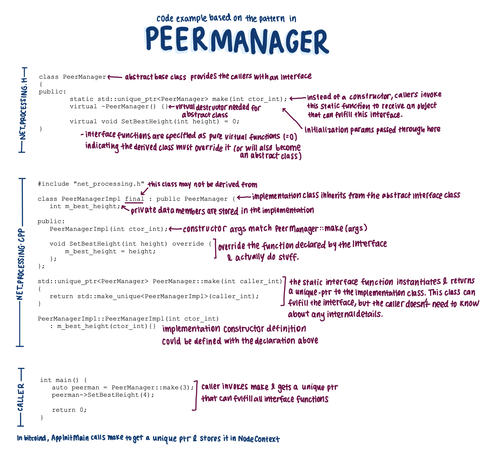
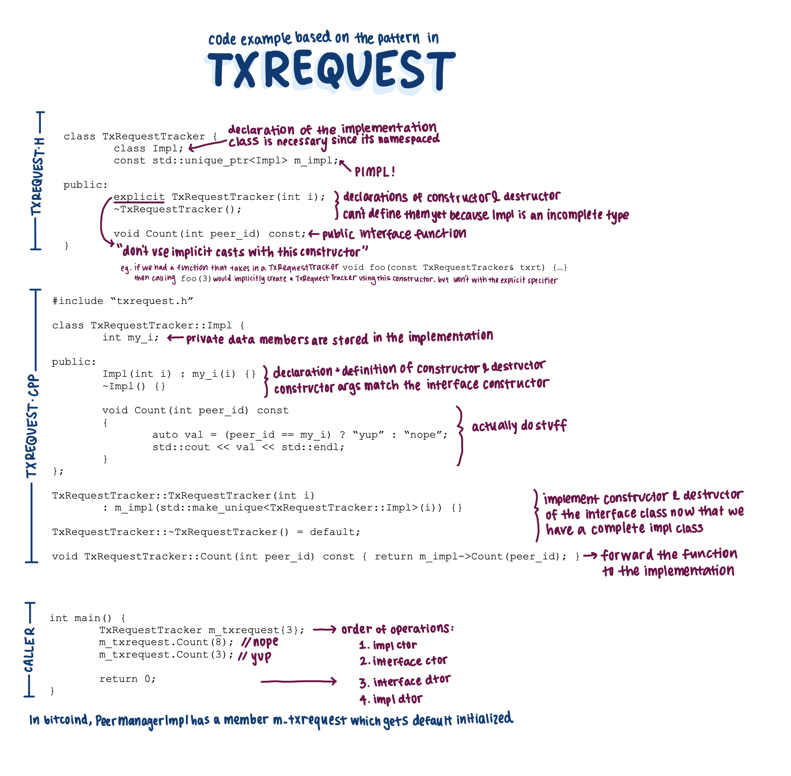
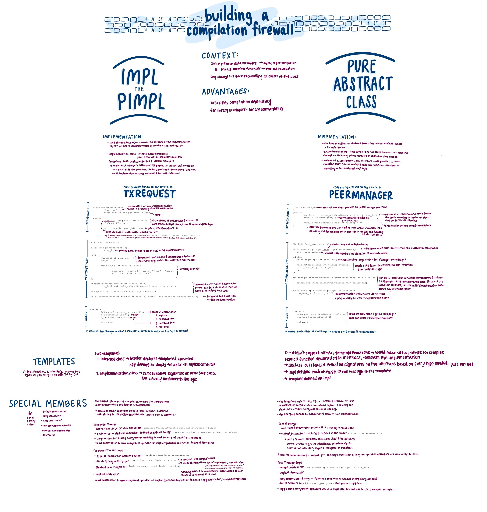

## Notes

- This week's review club will focus on C++ patterns that separate
  the implementation details of a class from its external interface.
  [PR 22950](https://github.com/bitcoin/bitcoin/pull/22950) is a fully
  implemented example, but we'll take the scenic route there to understand the
  context and alternative approaches.

- In a normal C++ class, changing any implementation detail usually requires all
  client code to be recompiled. This is because private data members can change the
  size of the object, and private member functions participate in overload
  resolution. Those members are included in the header
  file, and any translation unit which `#include`s the header file will need to be
  recompiled if that file changes.

- There are multiple ways to get around this compilation dependency. This week,
  we will focus on two: the pimpl pattern & a pure abstract class. I've
  included annotated versions of toy programs that are minimal implementations
  of both patterns. I highly recommend using them as a guide and creating your
  own.

- `PeerManager` & `PeerManagerImpl` use a pure abstract class to reduce the
  compilation dependencies. `PeerManager` defines a set of virtual functions
  that provides callers with an interface. `PeerManagerImpl` inherits from
  `PeerManager` and fulfills those functions, supplementing with any private
  data members or helper functions. Instead of callers constructing a
  `PeerManager` object, they call a static make function which returns an
  instantiated `PeerManagerImpl` object. This provides callers with exactly
  enough information to utilize the component, but nothing more.

    Here is a toy program to help understand the material. You can find the
    code in [abstract_class.h](../assets/txt/22950-abstract-class.h) and
    [abstract_class.cpp](../assets/txt/22950-abstract-class.cpp). Below is an
    annotated version of the program that dives into the specific mechanisms.

    

- `TxRequestTracker` & `TxRequestTracker::Impl` use the pimpl pattern to reduce
  the compilation dependencies. The interface object, `TxRequestTracker` owns a
  pointer to an implementation object, `TxRequestTracker::Impl`. When a caller
  invokes a function on the interface object, it gets forwarded to the
  implementation object to fulfill, and any return values are routed back
  through the same call path. Along with a forward declaration of the `Impl`,
  all the member functions of `TxRequestTracker` are declared in the header.
  However, the functions must be defined in the `.cpp` where the definition of
  a `TxRequestTracker::Impl` is complete.

    Here is a toy program to help understand the material. You can find the
    code in [pimpl.h](../assets/txt/22950-pimpl.h) and
    [pimpl.cpp](../assets/txt/22950-pimpl.cpp). Below is an annotated version
    of the program that dives into the specific mechanisms.

    

- Just for fun, one more diagram that puts it all together (and then some).

  

## Questions

1. Did you review the PR? [Concept ACK, approach ACK, tested ACK, or
   NACK](https://github.com/bitcoin/bitcoin/blob/master/CONTRIBUTING.md#peer-review)?

2. Why does changing implementation details of a class cause recompilation of
   all its callers?

3. Describe how the pimpl pattern & a pure abstract class work to reduce
   compilation dependencies. What are advantages & disadvantages of each?

4. Did you create your own toy programs? What were some challenges or
   learnings you had along the way?

5. [PR 22950](https://github.com/bitcoin/bitcoin/pull/22950) implements a pimpl
   pattern for AddrMan. What does this enable for the code organization? What
   restrictions still remain, and how does the PR address it?

6. What are relevant considerations for [special member
   functions](https://www.cplusplus.com/doc/tutorial/classes2/) for each of
   the two patterns?

7. How do each of the two patterns support template functions?

## Meeting Log


17:00 < jnewbery> #startmeeting
17:00 < jnewbery> Hi folks! Welcome to Bitcoin Core PR Review Club. Feel free to say hi to let everyone know you're here.
17:00 < CoinForensics> Hi (first PR Review Club, just lurking)
17:00 < ziggie> hi
17:00 < raj_> hi
17:00 < r-ush> hi
17:00 < naiza> Hi
17:00 < shoryak> hi
17:00 < zakinator123> Hello1
17:00 < lightlike> hi
17:00 < michaelfolkson> hi
17:00 < jnewbery> Welcome CoinForensics! Anyone else here for the first time?
17:00 < gene> hi
17:01 < amiti> welcome CoinForensics :) 
17:01 < r-ush> im here for the first time jnewbery
17:01 < zakinator123> Yes it's my first time as well!
17:01 < glozow> hi!
17:01 < jnewbery> This week's notes and questions (and diagrams!!) are here: https://bitcoincore.reviews/22950
17:01 < amiti> welcome r-ush & zakinator123 :) 
17:01 < jnewbery> welcome r-ush and zakinator123!
17:02 < glozow> it's my first time pimpling 👉👈
17:02 < jnewbery> There are a few tips about attending your first meeting here if things get confusing: https://bitcoincore.reviews/your-first-meeting
17:02 < larryruane> hi
17:02 < schmidty> hi
17:02 < jnewbery> Alright, I'll hand over to our host for this meeting, amiti!
17:03 < amiti> hi everyone! hope you're excited to get deep into this little corner of c++ :) 
17:03 < sipa> ohai
17:03 < amiti> to start with, did you review the notes, PR, or make toy programs? we can do a format of y / n / n 
17:04 < Azorcode> Hello everyone
17:04 < raj_> y/y/n
17:04 < michaelfolkson> y/y/n
17:04 < sipa> n / +- / n, and i suspect i'm missing out
17:04 < naiza> y/n/n
17:04 < shoryak> y/n/y
17:04 < CoinForensics> y/n/n
17:04 < gene> y / y / n
17:04 < larryruane> y / n / had trouble compiling the toys
17:04 < amiti> sipa: what are you missing out? 
17:04 < jnewbery> y / y / does Bitcoin Core count as a toy program?
17:04 < ziggie> y/n/n
17:05 < zakinator123> y/n/n
17:05 < amiti> larryruane: interesting, ok we can dig into the failures later. 
17:05 < sipa> amiti: the toys
17:05 < sipa> (and the rumours of comics)
17:05 < amiti> sipa: ah gotcha =P 
17:06 < amiti> ok, so let's dig in. why does changing implementation details of a class cause recompilation of all its callers?
17:06 < larryruane> because private stuff is in the header file
17:06 < gene> potential change in size of private members
17:06 < amiti> larryruane: that's true. why does it need to be there?
17:07 < gene> layout changes
17:07 < raj_> because each call site has to allocate space of the class, and it doesn't know what the space would be without recompiling the class again? 
17:07 < amiti> gene: yes! 
17:07 < larryruane> gene: +1
17:07 < michaelfolkson> Because in C++ when anything in a header file changes all users of that class must be recompiled
17:08 < amiti> yeah, so private member variables can change the size of the object 
17:08 < michaelfolkson> This seems to be a quirk to C++, I don't know if this the case with other object oriented languages
17:08 < amiti> what about private member functions, does anyone have ideas on that part? 
17:09 < sipa> michaelfolkson: more modern languages generally solve that problem by having different notions of compilation, and more explicit modules - fundamentally this problem always exists
17:09 < naiza> they are involved in overload resolution. 
17:09 < amiti> nazia: yes! 
17:10 < larryruane> private member functions are also in the header file, so if they change (which users of the class shouldn't care about), recompilation is needed
17:10 < amiti> so the accessibility of what callers can access can be restricted, but the compiler gets to know about private members & functions at all times, including when it compiles the calling code. 
17:10 < amiti> does that distinction make sense? 
17:10 < sipa> also all the type arguments and many more things in the header determine the symbol name it is compiled to; if you change the type of an argument to a function, all callers need to update the symbol name they link to
17:11 < larryruane> sipa: "more explicit modules" I think I've read that c++20 will support modules
17:11 < lightlike> does the need for recompiling everything actually depend on what is changed (variable, function)? i.e. if you just change a comment in the header, wouldn't there be a lengthy recompile even then?
17:11 < sipa> lightlike: indeed, though ccache will catch that i think
17:11 < sipa> as the precompilation output would be the same
17:11 < sipa> *preprocessing
17:12 < amiti> larryruane: yes the c++20 spec has support for modules, most compilers haven't fully implemented it yet though
17:12 < sipa> is c++20 final already?
17:12 < sipa> it is! since december 2020
17:14 < gene> awesome! side question: would modules be accepted into Bitcoin?
17:14 < sipa> lightlike: but yes, in general, because c++ has no real modules, it has no idea when interfaces change, and has to assume that whenever headers change, everything needs to be rebuilt
17:14 < sipa> gene: irrelevant until we switch to c++20, and that won't happen until it's widely available
17:14 < sipa> amiti has keyboard problems she will be back soon
17:14 < gene> sipa: +1
17:15 < amiti> I'm back! 
17:15 < zakinator123> amiti: So even if the public interface is the same, but new private members/functions are added to a class, recompilation of users of that class is required?
17:15 < amiti> ok let's dig in to how we can build compilation firewalls with C++ 
17:15 < amiti> Describe how the pimpl pattern & a pure abstract class work to reduce compilation dependencies. What are advantages & disadvantages of each?
17:15 < ementar4729> Does Bitcoin Core use C++ 11 ? If so, is there a reason to not switch to C++ 17 ?
17:15 < sipa> ementar4729: we use C++17
17:15 < sipa> zakinator123: indeed
17:15 < larryruane> sometimes _just for testing_ (obviously), i'll run a command like `touch -d '2 weeks ago' file.h` after changing file.h to speed up compile (but also need to update the timestamp on file.cpp)
17:16 < amiti> zakinator123: yes, that's true. but because of this design, there's also the breakup of header & cpp files, so even other changes to that file can cause recompilation of callers 
17:16 < Azorcode> Amiti your description about this PR is excellent
17:16 < sipa> ementar4729: https://bitcoin.stackexchange.com/questions/100545/what-version-of-c-is-used-in-bitcoin-core
17:16 < ementar4729> Thanks sipa
17:17 < amiti> Azorcode: thank you 
17:17 < Azorcode> ;D 
17:17 < michaelfolkson> amiti: Pimpl handles resource management but an abstract class doesn't
17:17 < amiti> michaelfolkson: what do you mean? 
17:17 < amiti> ok maybe we can take it one at a time 
17:18 < larryruane> pimpl: https://en.wikipedia.org/wiki/Fundamental_theorem_of_software_engineering "We can solve any problem by introducing an extra level of indirection" 😄
17:18 < michaelfolkson> Pimpl handles resources internally but with an abstract class the user has to take care of proper resource management
17:18 < amiti> since the notes start with the pattern of a pure abstract class- can anyone describe what the pattern is & how it can be used to reduce compilation dependencies? 
17:19 < amiti> larryruane: lol
17:19 < larryruane> i think a pure abstract class defines only an interface -- functions -- and has no state within itself
17:20 < amiti> larryruane: yup, and then how can we utilize that?
17:20 < larryruane> i think it's like traits in Rust (but grain of salt, i don't know Rust well)
17:20 < sipa> or interfaces in Java, type classes in haskell, ...
17:20 < amiti> I know very little about Rust =P 
17:22 < amiti> so yeah, the header defines an interface using a pure abstract class 
17:22 < Azorcode> rust is better
17:23 < michaelfolkson> Ha let's leave that discussion for another time
17:23 < amiti> since its an abstract class, it can't be instantiated. so there is another class that inherits from the base class & adds any private functions / members to fulfill the interface
17:23 < amiti> in that pattern, how does a caller instantiate an object?
17:23 < larryruane> amiti: "how can we utilize that?" ... you can then define an "implementation" class that inherits from the abstract class, fills out those functions' implementations, but then you can write a function whose argument is the abstract type, but the caller can pass it an object of the derived type --- looks like a type mismatch but it's not! (sorry probably didn't explain that well)
17:24 < zakinator123> amiti: By calling a static method defined in the abstract class that returns a pointer to the implementation class.
17:24 < amiti> larryruane: yes! 
17:24 < amiti> zakinator123: yes! 
17:24 < amiti> does that make sense to people? does anyone have questions?
17:24 < sipa> a static method?
17:24 < sipa> i'm confused
17:24 < raj_> amiti, does the abstract class approach also solves for this cascading compilation?  
17:25 < ementar4729> I think ScriptPubKeyMan is other example of abstract class. LegacyScriptPubKeyMan and DescriptorScriptPubKeyMan are the implementation.
17:25 < gene> do functions in pimpl work through dynamic dispatch like virtual overrides?
17:25 < larryruane> what really helped me on this topic is chapter 4 of the book "A Tour of C++ second edition" ... kindle version is pretty cheap
17:25 < zakinator123> So since the private and public members of the abstract class remain unchanged since all changes to implementation will be happening in the impl class, recompilation of dependencies is not needed?
17:25 < sipa> BaseSignatureChecker is also an abstract class
17:25 < michaelfolkson> larryruane: Cool, thanks. I had a look at the books referred to on the PR
17:26 < amiti> sipa: right, the static function is to connect using an abstract class with achieving the aims of reducing compilation dependencies
17:26 < sipa> oh
17:26 < sipa> we're not pimpling yet
17:26 < amiti> I'm sure there are other ways to do it too, but this is the pattern that is currently used in peermanager & was one I came across in other places too
17:26 < larryruane> sipa: "a static method?" I think this just means a function that can't access the `this` pointer because there is no object (it can be called with the double-colon syntax)
17:27 < amiti> no, this is an alternative to the pimpl :) 
17:27 < amiti> zakinator123: exactly right 
17:27 < sipa> larryruane: yes indeed; i was just confused what we were talking about - /ignore me (not literally)
17:27 < amiti> ok, so hopefully that makes sense to people, feel free to speak up if you have more questions 
17:27 < amiti> but let's move on to how the pimpl works 
17:28 < amiti> ... anyone want to describe how the pimpl pattern works? :) 
17:28 < larryruane> so I guess pimpl is more recent than the abstract class idea?
17:28 < jnewbery> Here's the static method in PeerManager, which makes and returns an instance of PeerManagerImpl: https://github.com/bitcoin/bitcoin/blob/419afa93419e6840f78cb94b4a39d826eb10e139/src/net_processing.cpp#L1422-L1427
17:28 < grettke> amiti That sounds like Gang of Four Design pattern. Have you compared it to any of them?
17:28 < ementar4729> Singleton pattern ?
17:29 < larryruane> yep I think that's the convention (at least in bitcoin core), to call the instantiation method `make` ... i like that
17:29 < amiti> larryruane: I think they are just two ways to achieve the aim. the pimpl pattern seems to be more explicit / common in C++ literature. each one of these have lots of names for them.
17:29 < amiti> grettke: never heard of it 
17:29 < naiza> Pimpl moves the private data members to the separate class and then we access them with the help of the unique pointer. 
17:29 < jnewbery> amiti: it's not required to have that static method. For example, look at how PeerManager implements the NetEventsInterface interface class: class PeerManager : public CValidationInterface, public NetEventsInterface
17:29 < ementar4729> Does pimpl use singleton pattern ?
17:30 < amiti> jnewbery: agreed, not required :) 
17:30 < jnewbery> init.cpp creates an instance of a PeerManager, but then passes it to CConnman as a pointer to a NetEventsInterface
17:31 < jnewbery> sorry, I'll stop talking about abstract classes. We've moved on to pimpls now
17:31 < amiti> nazia: mostly right, I'm not sure what you mean by the last part of how we access
17:31 < sipa> ementar4729: no, pimpl is not a singleton, as you can create multiple AddrMan objects
17:31 < sipa> (and each has their own implementation object)
17:32 < amiti> so the pimpl is very similar, but has some key differences 
17:33 < sipa> i don't think pimpl really matches any of those common design patterns; it's more a workaround for a limitation in the language, than a design i'd say
17:34 < naiza> amiti: In the header file only, we create a forward declaration which points at the implementation class and is used to access it?
17:34 < jnewbery> gene: > "do functions in pimpl work through dynamic dispatch like virtual overrides?" No, the forwarding from the outer class to the inner impl class is defined explicitly, eg everything from here downwards: https://github.com/bitcoin/bitcoin/pull/22950/files#diff-49d1faa58beca1ee1509a247e0331bb91f8604e30a483a7b2dea813e6cea02e2R1118
17:34 < amiti> nazia: yes!
17:35 < zakinator123> What is a "forward declaration"
17:35 < sipa> class Blup;
17:35 < sipa> just stating that a class with a certain name exists, without defining it
17:35 < amiti> its saying "this is the name of a class that exists, you'll learn more about it later" 
17:35 < gene> jnewbery: thanks, I also found some stuff on the cppreference page: https://en.cppreference.com/w/cpp/language/pimpl#Runtime_overhead
17:36 < gene> your explanation makes sense, though. no lookup, just a pointer indirection
17:36 < jnewbery> gene: nice reference. Thank you!
17:36 < amiti> so, we've mentioned some of these, but to make it explicit- what are some of the tradeoffs of using each of these patterns? 
17:36 < gene> does bitcoin use LTO?
17:36 < sipa> gene: no, we've experimented with it, but last we tried it was not a win iirc
17:37 < sipa> maybe time to try again
17:37 < michaelfolkson> LTO = Link time optimization (thanks search engine)
17:37 < gene> the cppreference link mentions link time optimization as a way to overcome some runtime costs for pimpl
17:38 < gene> :) thanks michaelfolkson 
17:38 < amiti> gene: oh interesting
17:38 < jnewbery> gene: yes, pimpl involves one extra pointer indirection. I don't know exactly how compilers implement vtables and dynamic dispatch, but I guess that the overhead is roughly equivalent
17:38 < grettke> sipa Regarding the pattern versus language specific feature implementation topic, gotcha, I see.
17:38 < sipa> gene: for such statements it's always useful to wonder how much it actually matters; the cost of a predictable function call is in the order of nanoseconds; that may matter for some use cases, but nothing in addrman needs anything near that kind of performance
17:39 < amiti> jnewbery: that's a succinct answer to the main tradeoffs between the two :) 
17:39 < larryruane> I just thought of something, couldn't abstract classes (not sure about pimpl) be very useful for testing, for mocking? The test framework could create a derived class that does very different stuff from the production derived class, and you pass the abstract object to the production code and it doesn't know the difference
17:40 < grettke> amiti The Gang of Four (GoF) book captures the logic and general design behind common (to them) patterns of OO code.
17:40 < gene> sipa: definitely agree, might be interesting if a pimpl winds up in a hot path somewhere
17:40 < sipa> jnewbery: the overhead is way less, because the linker resolves the function call, so the binary code actually has the memory address that's invokved; with vtables you have an indirection to even find out what code to call
17:41 < grettke> gene Is "hot path" the same as Wiki's "hot spot"?
17:42 < gene> hot path = performance critical execution path
17:42 < amiti> sipa: oh interesting. I'm guessing that's why the pimpl pattern is more common? using the abstract class thing made sense in PeerManager because there was already the virtual table lookups present. 
17:42 < sipa> amiti: it's definitely an advantage of pimpl; i don't think it's relevant for addrman, though :)
17:43 < amiti> sipa: that makes sense 
17:43 < amiti> thanks!
17:43 < amiti> ok, so next topic- I wanted to talk about the toy programs
17:43 < amiti> LarryRuane: this could be a good time to share your compilation issues?
17:44 < amiti> did anyone who got the chance to tinker have any learnings to share? 
17:44 < amiti> or anyone read the annotated code and have questions?
17:45 < larryruane> https://www.irccloud.com/pastebin/yM517JJg/
17:45 < amiti> ah, what did you call the .h? 
17:45 < jnewbery> There was a little bit of discussion on pimpl vs abstract class for PeerManager here: https://github.com/bitcoin/bitcoin/pull/20758#discussion_r548321467
17:45 < larryruane> pimpl.h
17:45 < amiti> larryruane: that's a relic of when I named it differently 
17:46 < amiti> there are two files and you just have to make sure one imports the other =P 
17:46 < michaelfolkson> Why was Txrequest a good example for Pimpl and why was Peer Manager a good example for abstract class?
17:46 < michaelfolkson> Why not just take one and then compare what Pimpl looked like versus abstract class?
17:46 < sipa> pimpl is for when you're only (ever) going to have one implementation
17:47 < amiti> oh, in my notes? 
17:47 < amiti> kinda arbitrary, I was learning about the patterns & the code at the same time. 
17:47 < michaelfolkson> Ok cool, just wondered if there was a reason :)
17:48 < amiti> ok in the last few minutes here, we could talk about the actual PR a bit =P 
17:49 < amiti> what does PR 22950 enable for the code organization? what are some other factors to consider VS with isolated toy programs?
17:51 < michaelfolkson> Apparently addrman rework is coming!
17:51 < sipa> *drumrolls*
17:51 < michaelfolkson> https://github.com/bitcoin/bitcoin/pull/22950#issuecomment-925715583
17:51 < michaelfolkson> Ha
17:53 < amiti> ok, maybe a more leading question.. what is addrman_impl.h? 
17:54 < michaelfolkson> The header file for the implementation of addrman?
17:54 < jnewbery> it declares the AddrManImpl class
17:54 < amiti> jnewbery: exactly 
17:54 < amiti> why does it have to be in this second header file? 
17:55 < jnewbery> so it can be included by the unit tests
17:55 < gene> to put it in its own translation unit
17:56 < amiti> jnewbery: exactly
17:56 < amiti> also fuzz tests 
17:56 < michaelfolkson> Without the second header file it couldn't be included in the unit tests? I missed that
17:56 < amiti> gene: hmm, I thought translation units are the things that get compiled together 
17:57 < amiti> so header files get compiled into whichever translation units that import it 
17:57 < gene> amiti: errant thought, ignore me
17:57 < jnewbery> so even though the addrman.h header is only exposing a very limited interface to the rest of the code, the tests can still access test functions and members
17:57 < amiti> jnewbery: nicely put 
17:58 < lightlike> so we shouldn't start importing addrman_impl from random non-test locations.
17:58 < amiti> lightlike: +1 
17:58 < amiti> ok last couple minutes here, does anyone have outstanding questions?
17:59 < jnewbery> lightlike: I think addrman_impl should only be included by addrman.cpp and tests
17:59 < amiti> jnewbery: isn't that what lightlike is saying? 
18:00 < lightlike> yes, that's what i meant to say
18:00 < amiti> alright, that's time! thanks for coming everyone :) 
18:00 < gene> thanks for hosting amiti 
18:00 < jnewbery> sorry, yes I interpreted his sentence as a question and then just repeated what he said 😳
18:01 < raj_> thanks for hosting amiti , really educational discussion.. 
18:01 < jnewbery> thanks amiti! Great meeting!
18:01 < larryruane> thank you so much, amiti and everyone else! this was awesome!
18:01 < CoinForensics> Thank you amiti for explaining everything!
18:01 < naiza> Thanks a lot! Got to learn a lot. 
18:01 < jnewbery> #endmeeting

