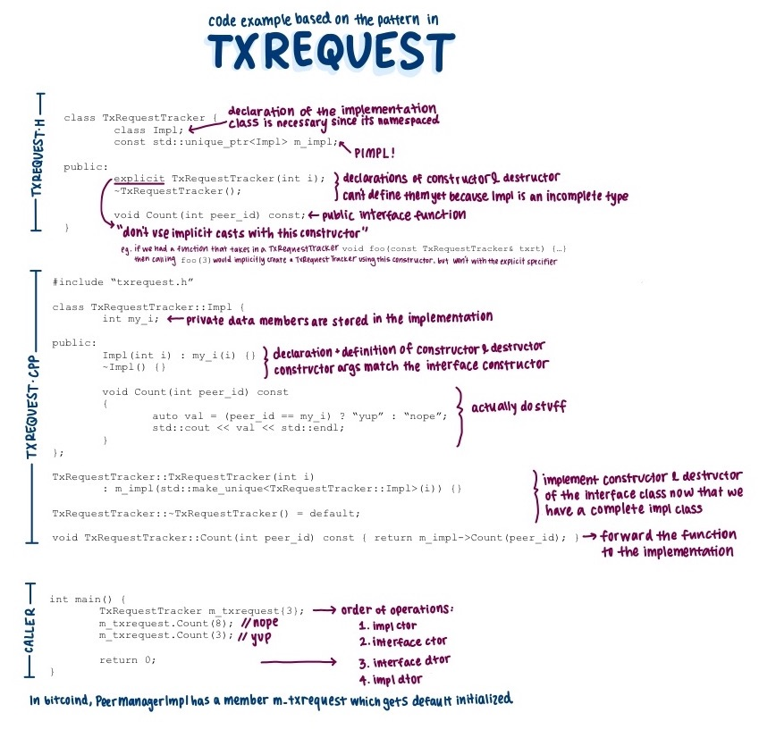

## Notes
- This week's review club is going to focus on C++ patterns that separate
  the implementation details of a class from it's external interface. We will
  use [PR 22950](https://github.com/bitcoin/bitcoin/pull/22950) as a fully
  implemented example, but we will take a scenic route there to understand the
  context and alternative approaches.

- In a normal C++ class, changing any implementation details requires all
  callers to be recompiled. This is because private data members can change the
  size of the object, and private member functions participate in overload
  resolution.

- There are multiple ways to get around this compilation dependency. This week,
  we will focus on two: the pimpl pattern & a pure abstract class. I've
  included annotated versions of toy programs that are minimal implementations
  of both patterns. I highly recommend using them as a guide and creating your
  own.

- `PeerManager` & `PeerManagerImpl` use a pure abstract class to reduce the
  compilation dependencies. `PeerManager` defines a set of virtual functions
  that provides callers with an interface. `PeerManagerImpl` inherits from
  `PeerManager` and fulfills those functions, supplementing with any private
  data members or helper functions. Instead of callers constructing a
  `PeerManager` object, they call a static make function which returns an
  instantiated `PeerManagerImpl` object. This provides callers with exactly
  enough information to utilize the component, but nothing more.

  Here is an annotated toy program that demonstrates this pattern.
  

- `TxRequestTracker` & `TxRequestTracker::Impl` use the pimpl pattern to reduce
  the compilation dependencies. The interface object, `TxRequestTracker` owns a
  pointer to an implementation object, `TxRequestTracker::Impl`. When a caller
  invokes a function on the interface object, it gets forwarded to the
  implementation object to fulfill, and any return values are routed back
  through the same call path. Along with a forward declaration of the `Impl`,
  all the member functions of `TxRequestTracker` are declared in the header.
  However, the functions must be defined in the `.cpp` where the definition of
  a `TxRequestTracker::Impl` is complete.

  Here is an annotated toy program that demonstrates this pattern.
  

- Just for fun, one more diagram that puts it all together (and then some).

## Questions
1. Did you review the PR? [Concept ACK, approach ACK, tested ACK, or
   NACK](https://github.com/bitcoin/bitcoin/blob/master/CONTRIBUTING.md#peer-review)?

2. Why does changing implementation details of a class cause recompilation of
   all its callers?

3. Describe how the pimpl pattern & a pure abstract class work to reduce
   compilation dependencies. What are advantages & disadvantages of each?

4. Did you create your own toy programs? What were some challenges or
   learnings you had along the way?

5. [PR 22950](https://github.com/bitcoin/bitcoin/pull/22950) implements a pimpl
   pattern for AddrMan. What does this enable for the code organization? What
   restrictions still remain, and how does the PR address it?

6. What are relevant considerations for [special member
   functions](https://www.cplusplus.com/doc/tutorial/classes2/) for each of
   the two patterns?

7. How do each of the two patterns support templated functions?

<!-- TODO: After meeting, uncomment and add meeting log between the irc tags
## Meeting Log



-->
