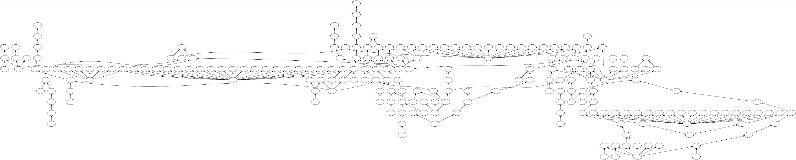
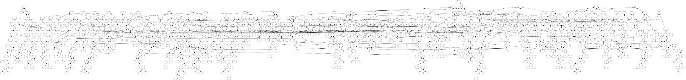

## Notes

### Background

Attendees should familiarize themselves with Bitcoin Core's [Replace by Fee (RBF)
policy](https://github.com/bitcoin/bitcoin/blob/v24.0.1/doc/policy/mempool-replacements.md). These
notes will refer to Bitcoin Core's rules (not
[BIP125](https://github.com/bitcoin/bips/blob/a200aed81d466e62f2bc2ad3c3fec31002050262/bip-0125.mediawiki)'s
rules) by number.

A **package** is an ordered list of transactions, representable by a connected Directed Acyclic
Graph (a directed edge exists between a transaction that spends the output of another transaction).

**Package CPFP** describes a policy enabling a child transaction to pay for a parent transaction
when submitted together as a package, even if the parent does not meet all fee requirements on its
own. Package CPFP allows L2 protocols to sign transactions with a low (or zero) feerate, and then
add fees at broadcast time, even if the mempool minimum feerate rises above the presigned
transaction's feerate. Package CPFP was discussed in a [previous review club meeting](/24152).

**Package RBF** describes a policy enabling a child to pay for replacing transactions its parent
conflicts with when they are submitted as a package. (Package CPFP is a prerequisite for this). The
main use case of Package RBF is to allow LN commitment transactions (which conflict with each other
but whose fees cannot be changed) to replace each other in mempools using fees added at broadcast
time using children attached to anchor outputs.

A **Pinning Attack** is a type of transaction relay censorship in which the attacker takes advantage of mempool policy
to prevent a transaction from being mined or entering a mempool. An introduction to mempool policy and pinning attacks
is transcribed
[here](https://btctranscripts.com/adopting-bitcoin/2021/2021-11-16-gloria-zhao-transaction-relay-policy/#mempool-policy).

A "v3 transaction" refers to a transaction that has its `nVersion` field set to `3`. These types of
transactions are currently nonstandard in Bitcoin Core.

[PR #25038](https://github.com/bitcoin/bitcoin/pull/25038) originally only implemented package RBF based on a simple
extension of Bitcoin Core's replacement policy. However, after the realization that the utility of package RBF would be
nullified by RBF's pinning problems, development effort shifted to fixing RBF in general. As such, the scope of the PR
grew to include v3 as well.

The v3 commits include
[44fcc4d](https://github.com/bitcoin-core-review-club/bitcoin/commit/44fcc4d3912e21b055c377549c8882c67dddf278)...[3db3e45](https://github.com/bitcoin-core-review-club/bitcoin/commit/3db3e45497ee6932f225b7a2025c2bfba5cfaa23).
The package RBF commits include
[58e811e](https://github.com/bitcoin-core-review-club/bitcoin/commit/58e811ecb1e1977422ecda2af62460e8efc057be)...[c27864f](https://github.com/bitcoin-core-review-club/bitcoin/commit/c27864fbca2421eeb64f13a803f7b4393999e1cf).

### Motivation

The high-level goal is to make competition for block space a purely fee-based market. More
specifically, if two parties are trying to get their conflicting transactions confirmed, the one
who broadcasts the transactions that are most profitable to mine should win, not the one who
broadcasts first or adds some specially-crafted, low-fee garbage transactions. Here are some of the
worst RBF limitations today:

- *Pinning through absolute fee rules (aka ["Rule 3"](https://github.com/bitcoin/bitcoin/blob/master/doc/policy/mempool-replacements.md#current-replace-by-fee-policy)
or "Rule 4" Pinning)*: RBF rules require the replacement transaction pay a higher absolute fee than the aggregate fees paid
by all original transactions. This rule seems to be the [most
headache-causing](https://gist.github.com/instagibbs/b3095752d6289ab52166c04df55c1c19#bip125-rule3).

	- Suppose Alice and Mallory have presigned transactions A and M, respectively, which conflict with one another
	  (e.g. commitment transactions for an LN channel together). Mallory broadcasts M first and can increase the
	fees required for Alice to replace M by:

		(1) Attaching transaction(s) that descend from M and pay a feerate too low to fee-bump M through
		   CPFP. For example, assuming the default descendant size limit is 101KvB and M is 1KvB paying a
		feerate of 2sat/vB, adding a 100KvB, 2sat/vB child increases the cost to replace M by 200Ksat.

		(2) Adding a high-fee descendant of M that also spends from a large, low-feerate mempool transaction,
		   C. The child may pay a very large fee but not actually be fee-bumping M if its overall ancestor
		feerate is still lower than M's individual feerate. For example, assuming the default ancestor size
		limit is 101KvB, M is 1KvB paying 2sat/vB, and C is 99KvB paying 1sat/vB, adding a 1KvB child of
		M and C increases the cost to replace M by 101Ksat.

- *Pinning through package limits*: All transactions admitted to the mempool must stay within package limits; no ancestor
  set or descendant set may exceed 25 transactions. Additionally, Rule 5 prohibits a replacement
that would cause the eviction of more than 100 entries.

	- When a candidate transaction would replace mempool transactions, it may also decrease the
	  descendant count of other mempool entries. Since ancestor/descendant limits are calculated
prior to removing the would-be-replaced transactions, they may be overestimated.
	Also see [Single-Conflict RBF Carve Out](https://github.com/bitcoin/bitcoin/blob/master/doc/policy/mempool-limits.md#single-conflict-rbf-carve-out).

	- If a transaction conflicts with multiple mempool entries, even if each entry is within the 25-descendant
	  package limit, it is possible to reach the Rule 5 limit. For example, conflicting with 6
transactions with 20 descendants each.

- *No increase in incentive compatibility required*: Theoretically, any replacement transaction should
  confirm faster than the one it replaced; a rational user would not intentionally pay more fees to
have their transaction confirm later. However, there is currently no rule to enforce this. As a
result, all transactions signed with SIGHASH\_ANYONECANPAY are vulnerable to being replaced by a transaction
that will confirm later than the original.

	- [Rule 6](https://github.com/bitcoin/bitcoin/blob/master/doc/policy/mempool-replacements.md#current-replace-by-fee-policy)
	was originally enforcing this, as the "incentive compatibility score" was previously just the
	feerate of the transaction. However, with the current ancestor set-based selection algorithm and
	possible package topologies, it isn't possible to implement a DoS-resistant way of calculating
	these scores (it potentially requires using every entry in the mempool, see
[this explanation](https://gist.github.com/glozow/25d9662c52453bd08b4b4b1d3783b9ff?permalink_comment_id=4093100#mining-score-of-a-mempool-transaction)
	if you are interested in more details).

- *Ancestor BIP125 signaling transactions does not imply replaceability*: Any descendant of an
  in-mempool transaction which signals replaceability is also replaceable because
it will be evicted if its ancestor is replaced. However, if the descendant is not signaling BIP125
*explicitly*, it cannot be directly replaced. A transaction that only conflicts with the descendant,
and not the BIP125-signaling ancestor, will be rejected.

- Transactions must meet RBF fee rules on their own: Package RBF (see [definition](#Definitions)
  above) is not currently possible. Package RBF would enable, for example, conflicting LN commitment
transactions (which tend to have fees that are too similar to replace one another) to replace each
other utilizing fees from a fee-bumping child.

- Further reading on L2 pinning grievances:
	* [Bringing a nuke to a knife fight: Transaction introspection to stop RBF pinning](https://lists.linuxfoundation.org/pipermail/bitcoin-dev/2022-May/020458.html)
	* [RBF Pinning with Counterparties and Competing Interest](https://lists.linuxfoundation.org/pipermail/lightning-dev/2020-April/002639.html)
	* [Pinning : The Good, The Bad, The Ugly](https://lists.linuxfoundation.org/pipermail/lightning-dev/2020-June/002758.html)
	* [Pinning Attacks Document](https://github.com/t-bast/lightning-docs/blob/master/pinning-attacks.md)
	* [Eltoo Pinning](https://gist.github.com/instagibbs/60264606e181451e977e439a49f69fe1)

A larger list of RBF limitations was discussed last year on [this mailing list
post](https://lists.linuxfoundation.org/pipermail/bitcoin-dev/2022-January/019817.html) and
[gist](https://gist.github.com/glozow/25d9662c52453bd08b4b4b1d3783b9ff). Various proposals to amend or rewrite RBF
policy were discussed on those threads. The discussions resulted in this v3 proposal to address most issues. Additional
RBF improvements (which do not conflict with v3) are also being considered.

### V3 Policy

[Package limits](https://github.com/bitcoin/bitcoin/blob/v24.0.1/doc/policy/mempool-limits.md) exist to limit the
worst-case computational complexity of mempool operations such as block template assembly and new transaction
validation. However, **current limits still allow huge clusters of transactions to exist in the mempool**.
For example, Xekyo has [tweeted](https://twitter.com/murchandamus/status/1352850189686599680) clusters of 219
and 881 transactions found in a default mempool:

One diagnosis of these RBF limitations is that current mempool policy is far too permissive in the
possible package topologies it accepts. The reason we cannot add an RBF rule comparing incentive
compatibility scores is that calculating them involves, at minimum, looking at its cluster (since
any transaction in the cluster may impact its incentive compatibility score), and there are no
limits on how large a cluster can be. In fact, the entire mempool could be one cluster.
Additionally, Rule 3 pinning is possible precisely because a counterparty has the freedom to attach
transactions to impact the incentive compatibility of the shared transaction.

The simplest mempool policy would be to never allow transactions spending unconfirmed UTXOs, i.e., a maximum package
size of 1. This doesn't work because L2 protocols require the ability to spend unconfirmed outputs, but a package of 1
parent and 1 child is enough: the presigned transaction plus a child attaching fees at broadcast time.

Why allow such crazy clusters of transactions into our mempool if we cannot properly track them or assess their
incentive compatibility afterward, especially if there is no use case beyond pinning attacks?

The philosophy behind [v3](https://bitcoinops.org/en/topics/version-3-transaction-relay/) is to equalize what
transactions the mempool permits with what it can feasibly handle, while enabling L2 use cases. In a v3 world, cluster
size is limited to 2. This fact enables us to, for example, add an incentive compatibility rule to RBF without
potentially needing to iterate through more than 2 transactions.

V3 rules (see
[docs](https://github.com/bitcoin-core-review-club/bitcoin/blob/7198dac47279967be1a5d97c5423df60ff3b7df5/doc/policy/version3_transactions.md#version-3-rules)
for rationale) are as follows:
- A v3 transaction signals replaceability, even if it does not signal BIP125 replaceability.
- Any descendant of an unconfirmed V3 transaction must also be V3.
- A V3 transaction's unconfirmed ancestors must all be V3.
- A V3 transaction cannot have more than 1 unconfirmed descendant.
- A V3 transaction that has an unconfirmed V3 ancestor cannot be larger than 1,000 virtual bytes.
- A V3 transaction cannot have more than 1 unconfirmed ancestor.

Notice a few nice properties of v3 packages and transactions (from most obvious to least obvious):
- A v3 transaction in mempool cannot have more than 1 descendant.
- A v3 transaction in mempool cannot have more than 1 ancestor.
- When a v3 transaction is being replaced, it has at most 1 descendant. That descendant adds no more than 1,000vB to what needs to be evicted.
- When the descendant of a v3 transaction is being replaced, there must be exactly 1 replacement transaction and 1 to-be-replaced transaction.
- When a v3 transaction is being replaced, it is the sponsor of either 0 or 1 0-fee parents.
- There is no difference between a v3 transaction having "explicit" and "inherited" replaceability signaling.
- The incentive compatibility score of a transaction is equal to the minimum between its ancestor feerate and individual feerate.
- When the descendant of a parent v3 transaction is being replaced, the parent's descendant count does not change, and its descendant size changes by the difference between the replacement and to-be-replaced transactions.
- RBF carve out is not needed.
- Given an unconfirmed v3 transaction of size `s` paying fees `f`, a maximum-size child paying the same feerate pays `f/s * 1,000` in fees.

Further work that may enable more benefits:
- The [Ephemeral Outputs](https://github.com/bitcoin/bitcoin/pull/26403) proposal builds on top of v3, offering an
alternative to [SIGHASH\_GROUP](https://lists.linuxfoundation.org/pipermail/bitcoin-dev/2021-July/019243.html), with
most of the features and a policy-only changeset.
- Ephemeral outputs may be used to enable [Eltoo](https://bitcoinops.org/en/topics/eltoo/), which also
[hinges](https://bitcoinops.org/en/newsletters/2022/05/18/#using-transaction-introspection-to-prevent-rbf-pinning) on the resolution of these RBF limitations.
- As v3 and package RBF would allow counterparties to replace each others' commitment transactions, just a single anchor
  output per commitment transaction could be sufficient. This may eventually allow the removal of
[CPFP carve out](https://github.com/bitcoin/bitcoin/blob/master/doc/policy/mempool-limits.md#cpfp-carve-out).

## Questions

1. Did you review the PR? [Concept ACK, approach ACK, tested ACK, or NACK](https://github.com/bitcoin/bitcoin/blob/master/CONTRIBUTING.md#peer-review)?
What was your review approach?

### Concept

1. What is the difference between a transaction that "explicitly" signals BIP125 and one that "inherits" BIP125
   signaling? Why is it impossible for a v3 transaction to be one but not the other?

1. Why should there be a rule to check whether a replacement transation is more incentive compatible to mine?

1. Is min(package feerate, individual feerate) an accurate incentive compatibility score for v3 transactions? What
   about in general? (See `CheckMinerScores()` [implementation](https://github.com/bitcoin-core-review-club/bitcoin/commit/58e811ecb1e1977422ecda2af62460e8efc057be)).

1. Imagine that there are two conflicting transactions, txA and txB, both 2,000vB. We *really* need one of them to confirm
   immediately, but it doesn't matter which one. A malicious counterparty has already broadcast transaction txB which
pays 10,000sat in fees (5sat/vB). We also know that it's guaranteed (just pretend, ok?) that anything above 20sat/vB
will be mined immediately, while anything below 20sat/vB will not.
	- Let's say txA and txB are non-v3 transactions. What fee can we put on txA to *guarantee* that either txA or
	  txB will reach a package feerate of 20sat/vB? (Hint: txA needs to replace txB and any descendants it may have.
	  In the non-v3 world, txA can have up to 99KvB of descendants. What is the maximum fee the counterparty can
	  attach to descendants of txB without bumping it to 20sat/vB?)
	- Now imagine txA and txB are both v3 transactions. What fee can we put on txA to guarantee that either txA or txB will
	  reach a package feerate of 20sat/vB? (Hint: in the v3 world, txA cannot have more than 1,000vB of descendants).

1. If all mining nodes on the network are running with this v3 policy, while none of the non-mining nodes are, what happens?

1. If 10% of nodes on the network are running with this v3 policy, while we haven't upgraded our node yet, what happens?
   What about 99% of nodes?

1. If we were running a business that accepted unconfirmed transactions as payments, what changes should we make so that our wallet correctly tracks v3 transactions?

1. Who might be interested in using v3 transactions? Who probably wouldn't be interested?

1. If there are some wallets/users/applications that use v3 while others don't, is there a privacy issue (i.e. people
   can fingerprint which wallet likely created a transaction by looking at its version)?

1. After the addition of v3, all non-v3 transactions are still subject to the existing limitations and pinning attacks.
   Wouldn't it be safer to enforce these rules for all transactions on the network?

1. V3 limits each transaction to 1 parent or 1 child (2 generations only), and perhaps that seems
   restrictive. Let's consider an alternative set of rules that allows each transaction to have 2
parents or 2 children (a transaction may have up to 2 children or up to 2 parents. They cannot have
both an unconfirmed parent and an unconfirmed child, so 2 generations only) - what would be the
maximum cluster size?

1. Why not limit the size of all v3 transactions to 1,000vB or something similarly small (Hint: what property of LN
   channels depends on standard transaction
[weight](https://github.com/lightning/bolts/blob/d975de1ba5d3e8aca586154ae0cae8f1b3181495/05-onchain.md#penalty-transactions-weight-calculation))?

### Implementation

1. Why does `ApplyV3Rules` [check](https://github.com/bitcoin-core-review-club/bitcoin/commit/44fcc4d3912e21b055c377549c8882c67dddf278#diff-a19c07329799a164e1e3bd89e7cd07f1a8e5e97b88f2b24c9bef17df04479c74R96-R101) whether the transaction conflicts with any of its ancestors' children? What happens if you remove this check?

1. V3 ancestor/descendant limits are stricter than the default mempool limits. Do we need to call both
   [`ApplyV3Rules`](https://github.com/bitcoin-core-review-club/bitcoin/commit/a74218d1571de5880ba7e0c168571f560d12d166#diff-97c3a52bc5fad452d82670a7fd291800bae20c7bc35bb82686c2c0a4ea7b5b98R923)
(which enforces v3 ancestor/descendant limits) *and*
[`CalculateMemPoolAncestors()`](https://github.com/bitcoin-core-review-club/bitcoin/commit/a74218d1571de5880ba7e0c168571f560d12d166#diff-97c3a52bc5fad452d82670a7fd291800bae20c7bc35bb82686c2c0a4ea7b5b98L878)
(which enforces ancestor/descendant limits)? Why or why not?

1. V3 rules are added to the [filtering function](https://github.com/bitcoin-core-review-club/bitcoin/commit/a74218d1571de5880ba7e0c168571f560d12d166#diff-97c3a52bc5fad452d82670a7fd291800bae20c7bc35bb82686c2c0a4ea7b5b98R353-R358) passed to `removeForReorg()` in `Chainstate::MaybeUpdateMempoolForReorg`.
Why do we need to check v3 rules in a reorg?

1. Is `CTxMemPool::removeForReorg()` the appropriate place for this check? Can you think of an alternative place to add this check?

1. How does
   [`CheckMinerScores`](https://github.com/bitcoin-core-review-club/bitcoin/commit/58e811ecb1e1977422ecda2af62460e8efc057be) determine whether one transaction or package is more incentive compatible to mine than another? Is this function 100% accurate for v3 transactions? What about for non-v3 transactions?

1. Why is it necessary to [evict all transactions below minimum relay feerate](https://github.com/bitcoin-core-review-club/bitcoin/commit/898847e1907eda3d87d19ea43099b71d9eded5f4) in `TrimToSize()`? (Hint: what does [this test](https://github.com/bitcoin-core-review-club/bitcoin/commit/3db3e45497ee6932f225b7a2025c2bfba5cfaa23#diff-15a1888c9151fc1d182c23e34b71d691f70df448bceb9eb78c8296f18854b6a3R216) check)?

1. Why must `PackageMempoolChecks` [never be called with only 1 transaction](https://github.com/bitcoin-core-review-club/bitcoin/commit/94c15f5e59413c6dbcedda1409f70a3f2bf211ac)? (Hint: an explanation can be found in [this commit](https://github.com/bitcoin-core-review-club/bitcoin/commit/27881f0d824d4dae11e5587ae4a2511a04e30c0e)).

### Rabbit Holes

1. V3 restrictions suck! Why can't we just replace RBF Rules 3 and 4 with a *better* rule based on feerate? For example, "replacement tx must have a feerate 2x higher than each of the transactions it's replacing."

1. Why not allow packages with multiple parents and 1 child in v3?

1. Theoretically, if the mempool is not full, the maximum number of transactions that may be removed in a replacement is 100 (due to Rule 5). After [this commit](https://github.com/bitcoin-core-review-club/bitcoin/commit/898847e1907eda3d87d19ea43099b71d9eded5f4), what is the new limit?

Also feel free to bring your own questions.

<!-- TODO: After meeting, uncomment and add meeting log between the irc tags
## Meeting Log



-->
